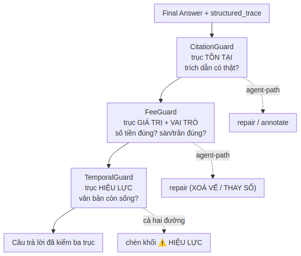
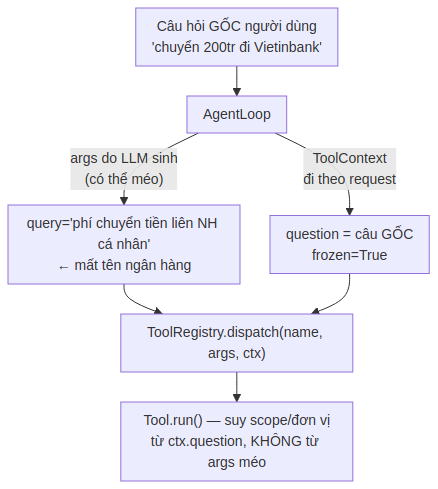
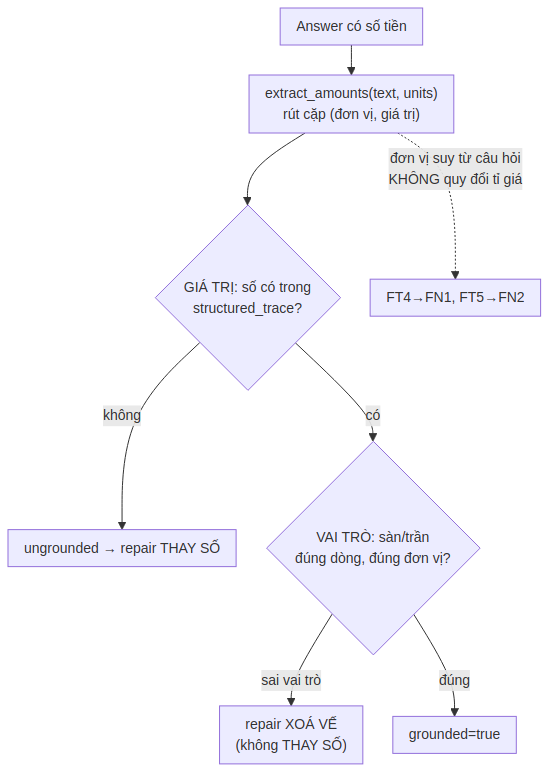
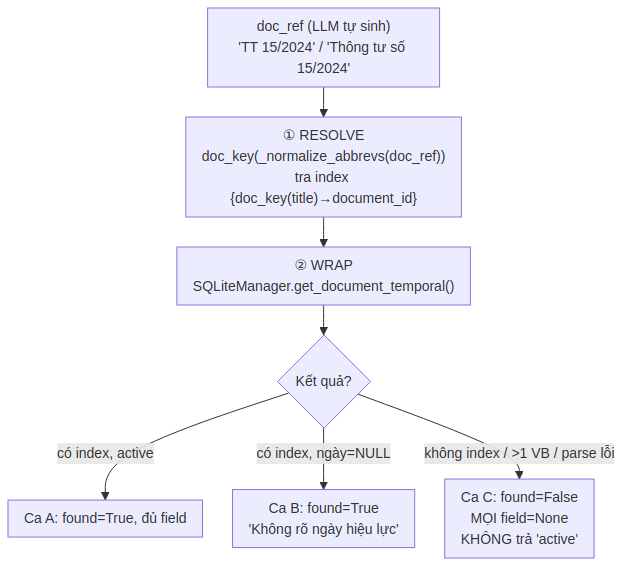
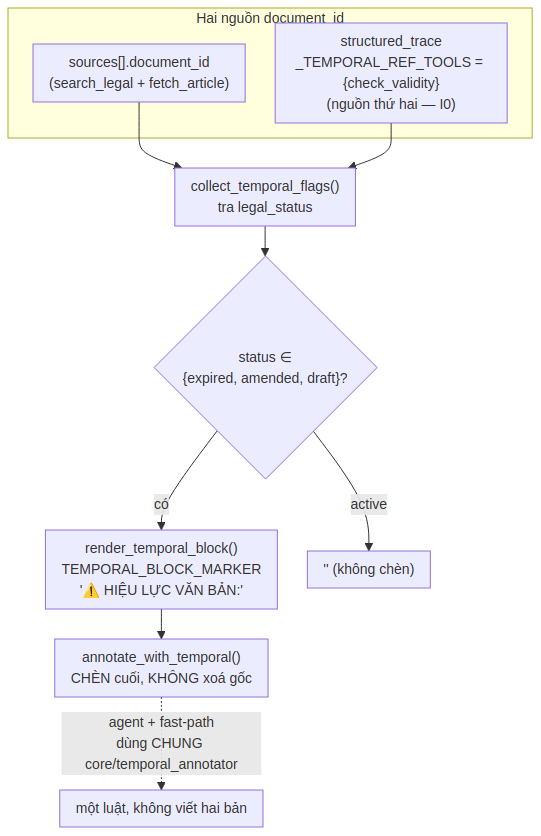
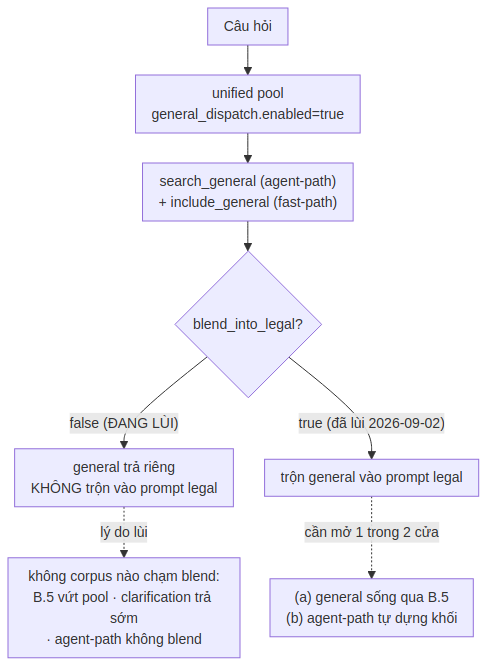
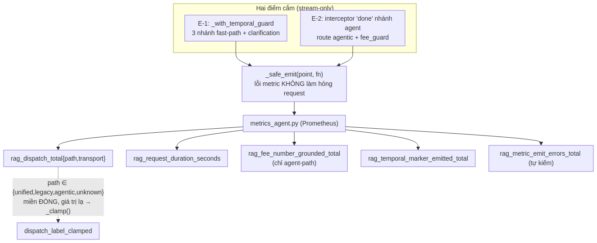
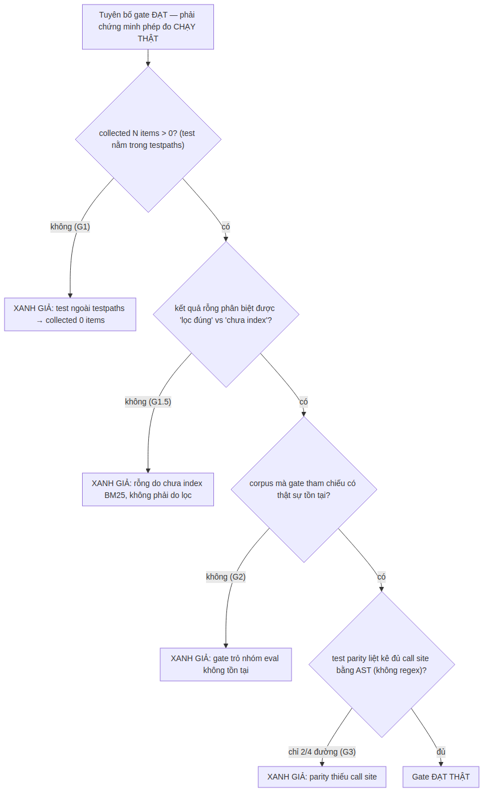

# PHẦN 6 — NÂNG CẤP AGENTIC RAG

## 1. Giới thiệu Phần 6

Phần này tài liệu hóa **bản nâng cấp Agentic RAG** — lớp khả năng mới được bổ sung vào phân hệ `rag-core` để hệ thống trả lời được các câu hỏi **đa bước** mà pipeline RAG-SQLite cũ không xử lý được. Về mặt mã nguồn, toàn bộ phần nâng cấp nằm gọn trong Phase 3 — Generation (`rag-core/phase3_generation/core/agent/`), nên Phần 6 này là **phần mở rộng trực tiếp của Phần 2 §4 (Phase 3 — Generation)**. Người đọc nên nắm Phần 2 trước khi đọc Phần 6.

### 1.1 Vì sao cần Agentic RAG (Why)

Pipeline RAG-SQLite hiện tại (mô tả đầy đủ ở Phần 2) xử lý câu hỏi theo một mạch tuyến tính: phân loại nội dung → điền slot → retrieve **một lần** → gọi LLM **một lần** → trả lời. Mạch này hiệu quả và an toàn cho phần lớn câu hỏi tra cứu đơn (vd "Điều 5 Thông tư 39 quy định gì?"), nhưng có hai giới hạn cố hữu:

- **Loại trừ legal ↔ tabular.** Bộ phân loại (ContentTypeClassifier, Phần 1 §6) chọn *một* nhánh — hoặc pháp lý, hoặc biểu phí. Câu hỏi cần *cả hai* (vd "phí chuyển khoản là bao nhiêu và căn cứ pháp lý nào quy định?") bị ép về một nhánh, mất thông tin nhánh kia.
- **Chỉ retrieve một lần.** Câu hỏi cần *so sánh nhiều văn bản* (vd "so sánh phí chuyển khoản giữa Thông tư 39 và Thông tư 15") đòi hỏi nhiều lượt tìm kiếm độc lập rồi tổng hợp — điều một lượt retrieve không làm được.

Agentic RAG giải bài toán này bằng cách thay "bộ não điều hướng tĩnh" (code Python: classifier + slot pipeline) bằng một **vòng lặp ReAct** trong đó LLM tự quyết định gọi công cụ (tool) nào, gọi mấy lần, theo thứ tự nào — cho tới khi đủ căn cứ để trả lời.

So sánh hai mô hình tư duy:

| Khía cạnh | RAG thường (pipeline cũ) | Agentic RAG |
|---|---|---|
| Bộ não điều hướng | Code Python tĩnh (classifier + slot) | LLM tự lập kế hoạch |
| Số lượt retrieve | Đúng 1 lần | N lần (LLM quyết) |
| Câu hỏi đa bước | Không xử lý được | Xử lý được |
| legal + tabular | Loại trừ — chọn 1 nhánh | Kết hợp được |
| Chi phí | Thấp, ổn định | Cao hơn (nhiều lượt gọi LLM) |

### 1.2 Ba ràng buộc cứng (nguyên tắc thiết kế cốt lõi)

Toàn bộ thiết kế Agentic RAG bị chi phối bởi **ba ràng buộc cứng** — không được phá vỡ trong bất kỳ thay đổi nào về sau. Đây là điểm khác biệt quan trọng nhất giữa hệ thống này và một agent RAG thông thường:

1. **Không hallucinate điều khoản.** Mọi trích dẫn pháp lý trong câu trả lời (Điều X, Khoản Y, văn bản Z) phải **verify được** trên dữ liệu thật do tool trả về. → Thực thi bởi **CitationGuard** (§5) + nhóm eval đối kháng N4 (§8).
2. **Phạm vi đóng kín (closed-world).** Agent chỉ được truy cập kho đã index — **không có tool tra web**. Nhờ vậy mọi nguồn nằm trong kho, mọi trích dẫn verify được 100% bằng exact-match. → Bộ tool ban đầu gồm 4 tool, về sau bổ sung tool thứ 5 `check_validity` (§14); không tool nào ra Internet (§3, §14).
3. **Độc lập backend.** Hệ thống sẵn sàng chuyển sang LLM local (VinaLlama/Llama3) khi có hạ tầng GPU on-premise. → Cơ chế tool-calling dùng **ReAct prompt-based** (LLM xuất text), **không** dùng native function-calling của nhà cung cấp.

Nguyên tắc bao trùm, đúc kết cả ba ràng buộc trên thành một câu:

> **LLM được tự do về điều hướng, nhưng bị kỷ luật về trích dẫn.**

### 1.3 Bất biến quan trọng nhất: zero-regression khi tắt

Agentic RAG được bọc sau một **công tắc tổng** `agentic_rag` (mặc định `false`). Khi tắt, hệ thống chạy **đúng y như RAG-SQLite cũ** — không một dòng code agent nào được khởi tạo hay chạy (cơ chế "hai đường khởi tạo", §2.2). Đây là đường lùi an toàn tuyệt đối: nghi ngờ agent → đặt `false` + restart → về hệ cũ. Toàn bộ nội dung Phần 6 này **chỉ có hiệu lực khi `agentic_rag=true`**.

### 1.4 Mục lục Phần 6

Phần 6 chia hai khối. **Khối A–F (§2–§9)** là bộ khung Agentic RAG nền tảng (đã triển khai và deploy 2026-06-09). **Khối nâng cao (§10–§16)** là các trục kiểm soát bổ sung và năng lực mới thêm sau đó qua các giai đoạn G–J.

| § | Tiêu đề | Sơ đồ | Giai đoạn |
|:-:|---|:-:|:-:|
| 2 | Kiến trúc tổng thể + công tắc `agentic_rag` | Hình 6.1 | A |
| 3 | Lớp Tool — 4 tool bọc hàm Phase 2/MongoDB | Hình 6.2 | A |
| 4 | Vòng lặp ReAct + parser phòng thủ | Hình 6.3a, 6.3b | B |
| 5 | CitationGuard — chống hallucinate điều khoản | Hình 6.4 | C |
| 6 | Router + AgentOrchestrator | Hình 6.5 | D |
| 7 | Streaming verify-trước-stream + frontend | Hình 6.6 | E |
| 8 | Eval 4 nhóm + bật dần + `/health` mode | Hình 6.7 | F |
| 9 | Architecture Decision Records (ADR) | — | A–F |
| 10 | Ba trục Guard + bảng cờ production | Hình 6.8 | — |
| 11 | ToolContext — sự thật của lượt (bộ nhớ agent) | Hình 6.9 | G2 |
| 12 | search_tabular nâng cao — filter + effective_date | — | G1 |
| 13 | FeeGuard — trục GIÁ TRỊ và VAI TRÒ | Hình 6.10 | I |
| 14 | Trục HIỆU LỰC — check_validity + TemporalGuard | Hình 6.11, 6.12 | H |
| 15 | General dispatch + saga blend_into_legal | Hình 6.13 | GENERAL |
| 16 | Observability + kỷ luật chống "xanh giả" | Hình 6.14, 6.15 | J |
| 17 | ADR nâng cao (giai đoạn G–J) | — | G–J |

### 1.5 Quy ước ký hiệu trong Phần 6

- Hình vẽ đánh số `Hình 6.N`; sơ đồ phức tạp chia `a, b` có cross-reference.
- Code snippet lấy nguyên văn từ source thực tế tại `core/agent/`, lược bỏ boilerplate (import, docstring dài) chỉ giữ logic then chốt.
- Tham chiếu chéo: "Phần 2 §4" = mục 4 của Phần 2; "→ §5" = mục 5 trong chính Phần 6 này.

---

## 2. Kiến trúc tổng thể

### 2.1 Bức tranh toàn cảnh (What)

Agentic RAG cắm vào hệ thống tại **một điểm duy nhất**: bên trong `GenerationOrchestrator` (Phase 3), ngay sau bước `_classify_and_log()` của pipeline cũ. Tại đây, một công tắc và một router quyết định câu hỏi đi đường nào.


*Hình 6.1 — Điểm cắm Agentic vào GenerationOrchestrator. Khi `agentic_rag=false`, mọi câu hỏi đi thẳng pipeline RAG-SQLite nguyên trạng. Khi `true`, Router phân loại: câu đơn giản đi fast-path (pipeline cũ, không đổi), câu phức tạp vào AgentOrchestrator. Nhánh agent luôn có đường lùi (None/fallback) quay về fast-path nếu gặp sự cố — agent không bao giờ làm hỏng trải nghiệm so với hệ cũ.*

Cấu trúc thư mục của phần nâng cấp — toàn bộ nằm trong Phase 3:

```
rag-core/phase3_generation/
├── core/
│   ├── generation_orchestrator.py   ← PATCH: công tắc + điểm cắm router
│   └── agent/                        ← THƯ MỤC MỚI (9 file)
│       ├── __init__.py
│       ├── tools.py                 ← 4 tool + ToolObservation (§3)
│       ├── tool_registry.py         ← điều phối + phòng thủ (§3.4)
│       ├── react_parser.py          ← parser phòng thủ (§4.1)
│       ├── react_loop.py            ← động cơ ReAct (§4.2)
│       ├── prompts.py               ← system prompt ReAct (§4.5)
│       ├── citation_guard.py        ← chống hallucinate (§5)
│       ├── router.py                ← phân loại simple/complex (§6.1)
│       └── agent_orchestrator.py    ← lắp ráp A+B+C + streaming (§6.2)
├── configs/generation_config.yaml   ← PATCH: block agentic_rag + agent:
└── tests/                           ← 4 file test agent (118 check)
```

### 2.2 Công tắc `agentic_rag` — cơ chế hai đường khởi tạo (How)

Công tắc đặt ở cấp cao nhất của `generation_config.yaml`:

```yaml
# Override bằng biến môi trường: AGENTIC_RAG=true|false (ưu tiên cao hơn file).
# Đổi mode phải RESTART RAG-Core (công tắc cố định lúc khởi động).
agentic_rag: false   # false → pipeline hiện tại; true → Agentic RAG
```

Thứ tự ưu tiên giải quyết giá trị: **env `AGENTIC_RAG` > file config > mặc định `false`**. Hàm `_resolve_agentic_flag()` trong `generation_orchestrator.__init__` thực hiện việc này.

**Cốt lõi của zero-regression là cơ chế "hai đường khởi tạo":**

- Khi `agentic_rag=false`: `GenerationOrchestrator` **KHÔNG import** gói `agent`, **KHÔNG dựng** `ToolRegistry` / agent prompt / `CitationGuard` / `AgentOrchestrator` / `Router`. Các biến `_agentic_enabled=False`, `_router=None`. Mọi khối code agent trong `answer()` / `stream_answer()` bị bỏ qua hoàn toàn → hành vi **y hệt** RAG-SQLite cũ.
- Khi `agentic_rag=true`: mới dựng `AgentOrchestrator` (tái dùng `llm`, `_retrieval_orchestrator`, `_legal_handler` đã khởi tạo ở pipeline cũ — không tạo mới) + `Router`.

> **Lưu ý vận hành quan trọng:** Công tắc cố định lúc khởi động, **phải restart RAG-Core khi đổi mode** — không đổi giữa chừng để tránh hành vi không nhất quán trong cùng một session.

### 2.3 Vòng đời một request khi `agentic_rag=true`

```
GenerationOrchestrator.answer / stream_answer
  → _classify_and_log()              (như cũ — không đổi)
  → router.decide(question)
       ├─ simple  → fast-path        (pipeline cũ: classifier + slot + unified_dispatch)
       └─ complex → AgentOrchestrator
                      → AgentLoop.run()        → Final Answer + structured_trace
                      → CitationGuard.check()
                           ├─ all_verified → trả lời
                           ├─ còn sai + còn budget → repair (≤ max_repair_loops)
                           └─ còn sai + cạn budget → annotate (hạ cấp câu sai)
                      → None / fallback → fast-path
```

Điểm cắm nằm **ngay sau `_classify_and_log()` và TRƯỚC nhánh `unified_dispatch`** trong cả hai hàm `answer()` và `stream_answer()`. Câu đơn giản không bao giờ chạm code agent.

---

## 3. Lớp Tool (Giai đoạn A)

Vị trí: `core/agent/tools.py`, `core/agent/tool_registry.py`.

### 3.1 Triết lý: tool là lớp vỏ mỏng (Why)

Nguyên tắc nền tảng: tool **chỉ là lớp vỏ mỏng (thin wrapper)** bọc hàm ĐÃ ĐƯỢC KIỂM CHỨNG của hệ thống RAG-SQLite — **KHÔNG viết lại** logic retrieval. Mọi sức mạnh tìm kiếm vẫn nằm ở Phase 2 (Phần 2 §3); tool chỉ chuẩn hóa input/output để agent dùng được và để CitationGuard verify được.

Lợi ích: (1) không nhân đôi logic → không lệch hành vi giữa nhánh agent và fast-path; (2) tận dụng toàn bộ độ chín của Phase 2 (hybrid BM25+vector, RRF, rerank, article expansion); (3) bề mặt bảo trì nhỏ.

### 3.2 Bốn tool và hàm gốc được bọc (What)

| Tool | Hàm gốc được bọc | Input | Observation (structured) |
|---|---|---|---|
| `search_legal` | `RetrievalOrchestrator.retrieve()` | `query`, `domain?` | `citations[]`: `(document_id, title, article_number, clause_number, chunk_id)` |
| `search_tabular` | `RetrievalOrchestrator.retrieve_tabular()` | `query`, `type_tab?` | `items[]`: `(code_tab, type_tab, item_name, source_doc, score, text)` |
| `fetch_article` | `LegalHandler._lookup_document_id()` + `_fetch_chunks_from_mongodb()` | `doc_ref`, `article_num` | `(resolved, document_id, clauses[])` — **ground truth** cho CitationGuard |
| `compute` | `TabularAggregator.aggregate()` | `op` (COMPARE/MIN/MAX/LIST_ALL), `items` | `(format, markdown_table, sort_info, results)` |

**Phạm vi đóng kín:** Bốn tool trên là "thế giới" agent được phép truy cập ở khối nền tảng A–F. Không có tool tra web. Đây là điều kiện để CitationGuard verify được 100% (§5.1). Về sau, giai đoạn H bổ sung **tool thứ 5 `check_validity`** để tra hiệu lực pháp lý (§14) — vẫn tuân thủ closed-world, chỉ đọc từ index nội bộ.

Ví dụ một câu hỏi đa bước được giải bằng chuỗi tool:

> *"So sánh phí chuyển khoản của Thông tư 39 và Thông tư 15, nêu căn cứ pháp lý."*

```
search_tabular(query="phí chuyển khoản Thông tư 39")    → items A
search_tabular(query="phí chuyển khoản Thông tư 15")    → items B
compute(op="COMPARE", items="all_tabular")              → bảng so sánh (gộp A+B)
search_legal(query="căn cứ phí chuyển khoản")           → điều khoản liên quan
fetch_article(doc_ref="Thông tư 39", article_num=...)   → nguyên văn để trích dẫn
→ tổng hợp + Final Answer
```

### 3.3 `ToolObservation` — kết quả chuẩn hóa (How)

Mọi tool trả về một `ToolObservation` với **ba trường tách biệt**, mỗi trường một mục đích:

```python
@dataclass
class ToolObservation:
    tool_name: str
    ok: bool                                     # False khi lỗi — KHÔNG raise
    raw: str                                     # đầy đủ, cho log/debug
    structured: Dict[str, Any] = field(...)      # máy đọc — CitationGuard verify trên đây
    truncated_for_prompt: str = ""               # cắt ngắn — đưa vào prompt cho LLM
    error_message: Optional[str] = None
```

Vì sao tách ba trường:

- `raw`: chuỗi người-đọc-được, đầy đủ. Dùng cho log/debug.
- `structured`: dữ liệu máy-đọc-được. **CitationGuard đối chiếu trích dẫn trên trường này** (vd list các `(doc_ref, article_num, clause_num)` thật sự đã được tool trả về). Đây là "bằng chứng" chống hallucinate.
- `truncated_for_prompt`: bản cắt ngắn đưa vào prompt cho LLM. Observation đầy đủ có thể rất dài (nhiều Điều), sẽ làm tràn context window của model local nhỏ → phải cắt.

`ok=False` khi tool gặp lỗi hoặc input không hợp lệ; `error_message` giải thích để LLM **tự sửa** ở lượt sau. Nguyên tắc tuyệt đối: **tool KHÔNG bao giờ raise exception** — lỗi tool không được phép làm crash request.

### 3.4 `fetch_article` — trụ cột chống hallucinate

Đây là tool quan trọng nhất cho ràng buộc trích dẫn, vì nó cung cấp **ground truth** (nguyên văn Điều/Khoản từ MongoDB) để CitationGuard đối chiếu. Luồng: `doc_ref` (vd "Thông tư 39", "TT39") → `_lookup_document_id()` → `document_id` → `_fetch_chunks_from_mongodb(document_id, article_num)` → list các Khoản.

Ba ca xử lý, **đều KHÔNG bịa**:

1. **Văn bản + Điều có thật** → trả nguyên văn mọi Khoản (`resolved=True`, `clauses[]` đầy đủ).
2. **Văn bản không tồn tại** → `resolved=False`, báo "không tìm thấy trong kho".
3. **Văn bản có nhưng Điều không tồn tại** (nhóm đối kháng, vd Điều 99 của văn bản 30 điều) → `resolved=True` nhưng `clauses=[]`, báo rõ "văn bản không có Điều đó".

Ca 2 và 3 là tín hiệu để agent **từ chối đúng cách** thay vì tự suy diễn ra điều khoản không tồn tại.

### 3.5 `ToolRegistry` — điều phối + ba lớp phòng thủ

`ToolRegistry` là điểm trung gian **duy nhất** giữa vòng lặp và tool. Vì sao cần lớp này: model local nhỏ (VinaLlama 7B, Llama3 3B) thường xuất sai — gõ nhầm tên tool, JSON args hỏng, thiếu trường. `ToolRegistry.dispatch(name, args)` xử lý ba lớp phòng thủ:


*Hình 6.2 — Mọi tool call đi qua ToolRegistry: fuzzy match tên tool (sửa lỗi gõ của model nhỏ) → validate args → chạy trong try/except. Bốn tool đều trả về cùng cấu trúc ToolObservation, và khi lỗi thì trả `ok=False` chứ không raise — lỗi không bao giờ làm crash request.*

1. **Fuzzy match tên tool** (khoảng cách Levenshtein ≤ 2): `search_leagl` → `search_legal`. Nếu khác xa mọi tên → đường lùi: liệt kê danh sách tool hợp lệ cho LLM chọn lại.
2. **Validate args** trước khi chạy: thiếu arg bắt buộc / sai kiểu / `op` không hợp lệ → trả lỗi rõ ràng để LLM tự sửa ở lượt sau (không tốn công gọi DB).
3. **try/except cuối cùng** quanh `tool.run()`: phòng khi tool con quên bắt lỗi.

`render_catalog()` sinh đoạn mô tả tool để chèn vào system prompt ReAct (§4.5).

### 3.6 Lưu ý hợp đồng `compute`

`TabularAggregator.aggregate()` đọc `item.metadata` và `item.text` — tức cần object `RetrievalResult`, **không phải** dict. Trong khi đó `search_tabular` trả dict cho thân thiện với ReAct. Để dung hòa, `ComputeTool._dict_to_result()` dựng lại `RetrievalResult` từ dict trước khi gọi aggregator — gọi y như `tabular_handler` vẫn làm, không đổi logic aggregator. (Đây là một contract bug đã được phát hiện và sửa trong vòng review Giai đoạn A — xem §9 ADR-6.1.)

### 3.7 Kiểm thử

`tests/test_agent_tools.py` (30 check) — test độc lập, dùng fake cho Phase 2 + LegalHandler, **không cần DB thật**. Kiểm: tool gọi đúng hàm gốc với đúng tham số, chuẩn hóa kết quả đúng, và hành vi phòng thủ (lỗi → `ok=False` không raise, fuzzy match, validate). Chạy: `python tests/test_agent_tools.py`.

---

## 4. Vòng lặp ReAct + Parser phòng thủ (Giai đoạn B)

Vị trí: `core/agent/react_parser.py`, `core/agent/react_loop.py`, `core/agent/prompts.py`.

### 4.1 `ReActParser` — parser phòng thủ (Why + How)

Đây là thành phần phòng thủ quan trọng nhất Giai đoạn B, vì model local nhỏ thường xuất sai format ReAct. Parser biến output thô của LLM thành `ParsedStep` có ba loại: `action` (gọi tool), `final` (kết thúc), `error` (không parse được). Các ca xử lý:

1. Thiếu `Action:` nhưng có `Final Answer:` → kết thúc.
2. Có **cả** `Action` và `Final Answer` → **ưu tiên Action** (chưa kết thúc) — tránh model nhỏ kết thúc sớm khi đã chọn gọi tool.
3. `Action Input` không phải JSON hợp lệ → **cứu JSON nhẹ** (bỏ code fence ```` ```json ````, thêm ngoặc nhọn thiếu, đổi nháy đơn→kép, bỏ dấu phẩy thừa); vẫn hỏng → `error` với thông điệp hướng dẫn LLM xuất lại.
4. Không nhận diện được → `error` kèm nhắc khuôn ReAct.

Ranh giới trách nhiệm: parser **KHÔNG** quyết định tool có tồn tại không (đó là việc của `ToolRegistry` qua fuzzy match) — parser chỉ tách cấu trúc và cứu JSON. Cứu JSON "nhẹ" có chủ đích: không đoán quá tay để tránh hiểu sai ý LLM.

### 4.2 `AgentLoop` — động cơ ReAct (What)

`AgentLoop` điều phối vòng Thought → Action → Observation cho tới khi có Final Answer hoặc chạm budget. Mỗi bước dùng `llm.generate()` (non-stream) — lý do non-stream xem §7.1.


*Hình 6.3a — Một vòng lặp ReAct: sinh bước → parse → nếu là action thì dispatch tool và lưu kết quả vào scratchpad rồi lặp lại; nếu là final thì kết thúc. Hai cơ chế thoát an toàn: chạm budget hoặc ≥2 lỗi parse liên tiếp đều dẫn tới `_force_final()` ép LLM tổng hợp — tuyệt đối không trả lời rỗng.*

### 4.3 Scratchpad — nối kết quả giữa các bước

**Vấn đề:** model nhỏ không nên (và dễ làm hỏng) việc gõ lại nguyên một JSON lớn gồm danh sách items để gọi `compute`. **Giải pháp:** `AgentLoop` giữ một **scratchpad** tự động lưu `structured` output của mỗi tool call. Khi LLM gọi `compute` với `items` là **chuỗi tham chiếu** thay vì list, loop tự resolve:

| Tham chiếu | Nghĩa |
|---|---|
| `"last_tabular"` | items của lần `search_tabular` gần nhất |
| `"all_tabular"` | gộp items của MỌI lần `search_tabular` |
| `"tabular_<n>"` | items của lần `search_tabular` thứ n (1-based) |
| (list dict) | dùng thẳng — đường cũ vẫn hỗ trợ |

Nhờ vậy prompt nhỏ (quan trọng cho model local), tránh hỏng JSON, agent vẫn nối được kết quả nhiều bước. System prompt hướng dẫn LLM dùng `"all_tabular"` cho so sánh nhiều nguồn.

> **Lưu ý mở rộng:** khi thêm tool mới có output cần dùng lại ở bước sau, phải cập nhật hai chỗ trong `react_loop.py`: `_capture_to_scratchpad()` (lưu `structured`) và `_resolve_references()` (thêm cú pháp tham chiếu).

### 4.4 Budget — chống loop vô hạn


*Hình 6.3b — Hai cơ chế song hành: scratchpad cho phép `compute(items="all_tabular")` tự gộp kết quả các lần search trước (giữ prompt nhỏ), còn budget ba tầng chặn model nhỏ loop vô hạn. Chạm bất kỳ ngưỡng budget nào đều dẫn tới `forced_final` — và mọi đường thoát đều có `structured_trace` đầy đủ để CitationGuard verify.*

| Tham số | Mặc định | Tác dụng |
|---|:-:|---|
| `max_iterations` | 6 | Số vòng ReAct tối đa |
| `max_tool_calls_per_type` | 3 | Chặn gọi lặp cùng một tool |
| `wall_clock_timeout_s` | 30 | Chặn treo theo thời gian thực |

Khi chạm budget mà chưa có Final Answer: `_force_final()` ép LLM tổng hợp lần cuối từ các Observation đã có (chỉ thị "không gọi thêm tool; thiếu căn cứ thì nói rõ không có trong kho"). **Tuyệt đối không trả lời rỗng.**

Ba điều kiện thoát của loop (`stopped_reason`), cả ba đều có `structured_trace` đầy đủ:

- `final` — LLM đưa Final Answer hợp lệ.
- `forced_final` — chạm `max_iterations` hoặc timeout → ép tổng hợp.
- `error_fallback` — ≥2 lỗi parse liên tiếp → ép tổng hợp sớm, tránh model nhỏ kẹt xuất rác hết budget.

Mọi lỗi LLM/parse/tool đều được "nuốt" (không raise): lỗi parse → đưa thông điệp lại vào "băng" ReAct cho LLM tự sửa vòng sau; lỗi LLM → coi như bước rỗng → parser tạo `error` → loop tiếp tục.

### 4.5 System prompt ReAct (`prompts.py`)

`build_react_system_prompt(tool_catalog)` dựng prompt gồm: khuôn ReAct, danh mục tool (từ `ToolRegistry.render_catalog()`), và **nguyên tắc phạm vi đóng kín** — chỉ trả lời dựa trên Observation, không dùng kiến thức ngoài kho, không tìm thấy thì nói rõ "không có trong kho". Đây là **tầng phòng thủ trích dẫn THỨ NHẤT** (giảm tần suất sai); tầng cứng là CitationGuard (§5) verify exact-match trên DB.

### 4.6 Kiểm thử

`tests/test_agent_loop.py` (34 check) — dùng `ScriptedLLM` (trả lần lượt chuỗi ReAct định trước) để tất định: parser (action/final/cứu JSON/error), loop đa bước, scratchpad `all_tabular`, budget (max_iterations → forced_final, max_tool_calls_per_type → chặn), phục hồi sau output rác. Chạy: `python tests/test_agent_loop.py`.

---

## 5. CitationGuard — chống hallucinate điều khoản (Giai đoạn C)

Vị trí: `core/agent/citation_guard.py`. Đây là thành phần thực thi **ràng buộc cứng số 1** của toàn dự án. Chạy SAU khi AgentLoop có Final Answer, TRƯỚC khi trả cho người dùng.

### 5.1 Nguyên tắc: verify dựa trên BẰNG CHỨNG (Why)

Mọi trích dẫn pháp lý trong câu trả lời (Điều X, Khoản Y, văn bản Z) phải có **bằng chứng** rằng tool đã thực sự trả về nội dung đó. Bằng chứng nằm trong `AgentResult.structured_trace` — dữ liệu CÓ CẤU TRÚC do tool trả, **không phải** text LLM tự sinh. Vì phạm vi đóng kín (không web), mọi nguồn đều trong kho → verify được 100% bằng exact-match, **không có vùng xám**.

Đây là lý do **Agentic RAG an toàn HƠN RAG thường ở điểm trích dẫn:** pipeline một-lần tin thẳng output LLM; còn CitationGuard đối chiếu NGƯỢC mọi trích dẫn với dữ liệu thật. Trích dẫn không có bằng chứng → đánh dấu `unverified`, không suy đoán "chắc đúng".

### 5.2 Luồng xử lý (How)


*Hình 6.4 — CitationGuard trích mọi trích dẫn pháp lý từ câu trả lời, đối chiếu với structured_trace; trích dẫn nào chưa có bằng chứng thì gọi fetch_article xác minh trực tiếp trên DB. Chỉ khi văn bản + Điều + Khoản đều tồn tại mới `verified`; thiếu bất kỳ thành phần nào → `unverified` và bị CHẶN. Ba ca đối kháng (Điều/Khoản/văn bản không tồn tại) luôn rơi vào nhánh CHẶN.*

1. `extract_citations()` — trích mọi tham chiếu pháp lý bằng regex: `Điều \d+`, `Khoản \d+`, số hiệu `\d+/\d{4}/...`, và tên văn bản (`Thông tư 39`, `TT39`, `Nghị định 13`...). Gom theo **câu** để gắn đúng Điều/Khoản với văn bản trong cùng ngữ cảnh.
2. Với mỗi trích dẫn, tìm bằng chứng khớp trong `structured_trace` (`_match_in_evidence`).
3. Trích dẫn chưa có trong trace → gọi `fetch_article` xác minh trực tiếp:
   - văn bản + Điều + Khoản tồn tại → `verified`.
   - văn bản/Điều/Khoản không tồn tại → **không verified** (chặn).
4. Trả `GuardResult(all_verified, checks, unverified)`. `summary()` sinh thông điệp để repair.

### 5.3 Quy tắc khớp

Một trích dẫn khớp bằng chứng khi: Điều khớp (nếu trích dẫn nêu Điều) **VÀ** Khoản khớp (nếu nêu Khoản) **VÀ** văn bản khớp (nếu nêu văn bản). Trường nào trích dẫn KHÔNG nêu thì không ràng buộc trường đó — vd "Điều 6" (không nêu văn bản) chỉ cần có bằng chứng Điều 6 bất kể văn bản.

**Khớp văn bản linh hoạt:** câu trả lời có thể viết tắt (`TT39`) trong khi DB lưu title đầy đủ (`Thông tư 39/2016/TT-NHNN`). `_normalize_doc()` bỏ dấu, gộp biến thể (`thông tư`→`tt`, `nghị định`→`nd`), bỏ khoảng trắng; rồi khớp con hai chiều (`tt39` ⊂ `tt39/2016/tt-nhnn`).

> **Bug đã fix (Giai đoạn C):** Ký tự tiếng Việt "đ/Đ" (U+0111/U+0110) **không tách** qua chuẩn hóa NFD như các ký tự có dấu khác, khiến `_normalize_doc` xử lý sai "Nghị định"/"Quyết định" → khớp văn bản hỏng. *Triệu chứng:* trích dẫn Nghị định hợp lệ bị đánh `unverified`. *Nguyên nhân:* NFD không phân rã "đ". *Cách fix:* xử lý "đ/Đ" tường minh trước bước NFD. (Xem §9 ADR-6.4.)

### 5.4 Giới hạn có chủ đích

CitationGuard **CHỈ** verify trích dẫn pháp lý có cấu trúc (Điều/Khoản/số hiệu VB). Nó **KHÔNG** kiểm đúng/sai ngữ nghĩa của diễn giải — mục tiêu hẹp nhưng cứng: không để LLM viện dẫn điều khoản KHÔNG tồn tại hoặc KHÔNG được tool trả về.

### 5.5 Ba ca đối kháng phải LUÔN bị chặn

Đây là test bắt buộc giữ — sửa logic khớp mà một trong ba ca lọt nghĩa là đã phá ràng buộc cứng, **không được merge**:

1. **Điều không tồn tại** (vd Điều 99 của văn bản chỉ có 30 điều).
2. **Khoản không tồn tại** trong một Điều có thật.
3. **Văn bản không tồn tại.**

### 5.6 Kiểm thử

`tests/test_citation_guard.py` (21 check) — dùng fake `fetch_article`: trích dẫn, khớp trace, fallback fetch_article, **ba ca đối kháng** (đều bị chặn), khớp văn bản linh hoạt (`TT39`↔title đầy đủ), câu không trích dẫn → đạt. Chạy: `python tests/test_citation_guard.py`.

---

## 6. Router + AgentOrchestrator (Giai đoạn D)

Vị trí: `core/agent/router.py`, `core/agent/agent_orchestrator.py`, và patch vào `generation_orchestrator.py`. Đây là giai đoạn tích hợp lớn nhất — lần đầu A+B+C chạy cùng nhau trong luồng request thật.

### 6.1 Router — câu hỏi này có cần đa bước không? (What)

Router trả lời một câu hỏi độc lập: "câu này có cần xử lý đa bước không?", **vuông góc** với ContentTypeClassifier (Phần 1 §6 — vốn trả lời "câu này là legal hay tabular?"). Router dùng tín hiệu regex rẻ (**không gọi LLM**), không phụ thuộc output classifier.


*Hình 6.5 — Router phát hiện tín hiệu phức tạp bằng regex rẻ; tùy `router.mode` mà đi fast-path (shadow/off) hay vào agent (conservative + tín hiệu mạnh). Trong AgentOrchestrator, sau Final Answer là CitationGuard với chiến lược Hybrid: còn budget thì REPAIR, cạn budget thì ANNOTATE. Lỗi/rỗng ở bất kỳ đâu → fallback về fast-path.*

Bốn tín hiệu MẠNH (kích hoạt agent khi `require_explicit_signal=true`):

| Tín hiệu | Ý nghĩa |
|---|---|
| `compare+multi_doc` | so sánh + ≥2 văn bản |
| `mixed_tabular_legal` | vừa biểu phí vừa pháp lý |
| `aggregation_tabular` | cao nhất/thấp nhất + biểu phí |
| `multi_clause` | mệnh đề kép |

Ba chế độ vận hành:

| `router.mode` | Hành vi |
|---|---|
| `shadow` | luôn fast-path nhưng **GHI LOG** quyết định (pha đo, không rủi ro) |
| `conservative` | chỉ vào agent khi có tín hiệu MẠNH (mặc định vận hành) |
| `off` | luôn fast-path (tương đương không có router) |

Triết lý: **sai về phía bảo thủ rẻ hơn route nhầm câu đơn giản vào agent.** `require_explicit_signal=true` bỏ qua các tín hiệu yếu (prefix `weak:`).

### 6.2 AgentOrchestrator — lắp ráp toàn bộ (How)

`AgentOrchestrator` lắp ráp A+B+C: dựng `ToolRegistry` + system prompt + `AgentLoop` + `CitationGuard` (inject `FetchArticleTool`). Hai phương thức chính: `answer()` (chạy loop → áp CitationGuard → trả dict) và `stream_answer()` (phát event `step` → `token`/`done`, §7).

**FALLBACK xuyên suốt — agent không được làm hỏng trải nghiệm:** loop lỗi hoặc Final Answer rỗng → `answer()` trả `None` / `stream_answer()` phát `{type:fallback}` → caller (`GenerationOrchestrator`) tự quay về fast-path.

### 6.3 CitationGuard tích hợp — chiến lược Hybrid repair/annotate

Sau khi có Final Answer, `_apply_citation_guard()` chọn chiến lược theo `stopped_reason`:

- `stopped_reason="final"` (còn budget) → **REPAIR**: chạy loop thêm tối đa `max_repair_loops` vòng với gợi ý từ `GuardResult.summary()`; verify lại.
- `forced_final` / `error_fallback` (cạn budget/đang lỗi) → **ANNOTATE** ngay.

**ANNOTATE = HẠ CẤP** (không chỉ gắn nhãn): thêm cảnh báo rõ ràng nêu đích danh trích dẫn không có căn cứ, để người đọc không hiểu nhầm là khẳng định có cơ sở. Gắn nhãn suông vẫn là rủi ro hallucinate — phải hạ cấp đúng tinh thần đóng kín. (Điều chỉnh theo review Giai đoạn C — xem §9 ADR-6.5.)

### 6.4 Cấu hình

```yaml
agentic_rag: true

# Tham số chi tiết — CHỈ có hiệu lực khi agentic_rag=true.
agent:
  max_iterations: 6              # số vòng ReAct tối đa
  max_tool_calls_per_type: 3     # chặn gọi lặp cùng một tool
  wall_clock_timeout_s: 30       # chặn treo theo thời gian thực
  router:
    mode: conservative           # shadow | conservative | off
    require_explicit_signal: true  # nghi ngờ → fast-path (bảo thủ)
  citation_guard:
    enabled: true                # luôn bật khi agentic_rag=true
    max_repair_loops: 1          # số lần repair trước khi annotate
  streaming:
    emit_steps: true             # phát trạng thái trung gian (SSE event 'step')
```

### 6.5 Kiểm thử

`tests/test_agent_orchestrator.py` (23 check, gồm cả Giai đoạn E) — Router (đơn giản/so sánh/hỗn hợp/aggregation/shadow/off), `answer()` happy path, CitationGuard annotate (hạ cấp trích dẫn Điều 99 sai), fallback an toàn khi LLM lỗi, streaming (step→token→done), và flag resolution (env>config>default). Chạy: `python tests/test_agent_orchestrator.py`.

---

## 7. Streaming verify-trước-stream + frontend (Giai đoạn E)

Vị trí: `core/agent/agent_orchestrator.py` (`stream_answer`), frontend `agribank-chat` (`sseClient.js`, `useChat.js`, `MessageBubble.jsx`). Phần frontend liên hệ Phần 4 §5 (useChat hook + SSE streaming).

### 7.1 Nguyên tắc verify-TRƯỚC-stream (ràng buộc cứng) (Why)

Vòng lặp ReAct vốn **KHÔNG** stream — nó phải sinh trọn Final Answer để parse và để CitationGuard verify. Vì vậy thứ tự **bắt buộc** trong `stream_answer`:


*Hình 6.6 — Trình tự SSE của nhánh agent: chạy loop (non-stream) lấy trọn Final Answer → phát event `step` báo trạng thái → CitationGuard verify/repair/annotate TRỌN câu → mới phát `meta` rồi stream `token` (đã verify) → `done`. CitationGuard luôn chạy TRƯỚC token đầu tiên.*

1. Chạy `AgentLoop.run()` → Final Answer đầy đủ + `structured_trace`.
2. Phát các event `step` (trạng thái trung gian, vd "Đang tra cứu văn bản pháp lý...").
3. **CitationGuard verify/repair/annotate TRỌN câu trả lời.**
4. **MỚI** stream câu ĐÃ VERIFY ra từng mảnh (`token`).

Tuyệt đối KHÔNG stream token trước bước 3. Nếu stream trước rồi mới verify, người dùng đã thấy trích dẫn sai trước khi nó bị rút lại — vi phạm ràng buộc chống hallucinate. Vì sao loop dùng `generate()` non-stream: phải có TRỌN Final Answer mới parse được và verify được; stream thẳng token LLM ra người dùng = phát trích dẫn trước khi verify.

### 7.2 Token chunking (How)

`_chunk_text()` cắt câu trả lời **đã verify** thành nhóm ~4 từ để stream cho mượt (UX). Đây CHỈ là phân mảnh hiển thị — không ảnh hưởng tính đúng đắn vì toàn bộ text đã qua CitationGuard. Cách này cũng độc lập với khả năng stream của LLM (loop dùng `generate()` non-stream), nên hoạt động đồng nhất trên cả Gemini và model local.

### 7.3 Chuỗi event SSE của nhánh agent

```
step* (0..n, trạng thái trung gian)
  → meta (nguồn, phát SAU khi verify)
  → token* (các mảnh đã verify)
  → done
```

Nếu agent bỏ cuộc bất kỳ lúc nào trước khi stream nội dung → `fallback` (caller về fast-path). Client cũ bỏ qua event lạ nên không vỡ; chỉ cần thêm handler `step` để hiện trạng thái.

### 7.4 Frontend (`agribank-chat`)

- `sseClient.js`: thêm case `step` → callback `onStep(text)`.
- `useChat.js`: `onStep` tích lũy `steps[]` + `currentStep` trên message đang stream; token đầu tiên tới → xóa `currentStep`.
- `MessageBubble.jsx`: khi `isStreaming` và chưa có `content`, hiện `currentStep` kèm spinner ("Đang tra cứu văn bản pháp lý..."); khi token tới thì hiện nội dung.

> **Bug đã fix (Giai đoạn E):** `session_id` bị mất qua event `meta` của nhánh agent, khiến session **không đăng ký vào sidebar**. *Triệu chứng:* hỏi câu phức tạp xong, session không xuất hiện trong danh sách bên trái. *Nguyên nhân:* event meta của agent thiếu trường `session_id` mà pipeline cũ vẫn gửi. *Cách fix:* bổ sung `session_id`/`steps` vào meta event và đóng nốt call site. (Xem §9 ADR-6.6.)

---

## 8. Eval 4 nhóm + bật dần + `/health` mode (Giai đoạn F)

Vị trí: `performance_evaluation/agentic_eval/`, patch `api/main.py` (`/health`). Liên hệ Phần 2 §performance_evaluation và bộ eval gốc.

> **Lưu ý path:** `performance_evaluation/` là **sibling** của `rag-core/`. Script cần import `core.*`/`shared.*` phải thêm `/ "rag-core"` vào root path — đây là một bug từng làm scorer âm thầm vô dụng (xem §9 ADR-6.7).

### 8.1 Bộ eval 4 nhóm (What)

`agentic_eval_corpus.json` — mỗi câu có "đáp án vàng" về **CĂN CỨ** (không chỉ nội dung):


*Hình 6.7 — Bộ eval bốn nhóm N1–N4 đo các khía cạnh khác nhau; scorer chấm theo căn cứ. Quy trình bật dần: mặc định tắt → shadow (đo, không route) → phân tích log → conservative (bật thật) → /health phản ánh mode. Nếu N4 hallucination_rate > 0 thì DỪNG rollout ngay.*

| Nhóm | Mục đích | Chỉ số chính |
|---|---|---|
| N1_regression | agent KHÔNG làm hỏng câu đơn giản | route_correct (fast_path), answer_nonempty |
| N2_multi_doc | so sánh/tổng hợp ≥2 văn bản | citation_recall, tool_correct |
| N3_mixed | vừa biểu phí vừa pháp lý | tool_correct (search_tabular + search_legal/compute) |
| N4_adversarial | chống hallucinate | refusal_correct, hallucination_rate |

`agentic_eval_scorer.py` chấm theo căn cứ: citation_precision/recall (tái dùng `CitationGuard.extract_citations` + `_normalize_doc` — không viết lại logic verify), refusal_accuracy cho N4, tool_correctness, route_correctness. Scorer **KHÔNG tự chạy agent** (tách biệt để chạy offline/CI) — nhận file responses sinh sẵn rồi chấm. So sánh cặp: chạy cùng corpus qua agent và fast-path để đo `regression_delta` ở N1.

### 8.2 Bật dần shadow → conservative (How)

`router_log_analyzer.py` đọc log Router (pha shadow), đo tỉ lệ câu "phức tạp" + phân bố tín hiệu (reason). Dùng số liệu thật để quyết khi nào an toàn chuyển `router.mode: shadow → conservative`. Quy trình khuyến nghị:

```
Bước 0: agentic_rag=false              (mặc định an toàn — hệ chạy y RAG-SQLite)
Bước 1: agentic_rag=true, mode=shadow  (đo ~1 tuần, không route)
Bước 2: python router_log_analyzer.py --log rag-core/logs/generation.log
        → tỉ lệ "phức tạp" hợp lý: < 20%
Bước 3: mode=conservative              (bật thật — câu phức tạp mới vào agent)
Bước 4: eval định kỳ + canh hai chỉ số bắt buộc (§8.4)
```

### 8.3 `/health` phản ánh mode

`GET /health` thêm trường `mode: "agentic" | "classic"` (đọc `orchestrator._agentic_enabled`) để giám sát biết tiến trình đang chạy chế độ nào. Sau restart với `agentic_rag=false`, `/health` hiện `mode: classic`.

### 8.4 Hai chỉ số PHẢI canh khi rollout

- **N4 `hallucination_rate` = 0** — nếu >0: agent bịa trích dẫn → CitationGuard có lỗ hổng → **DỪNG rollout**.
- **N1 `regression_delta` ≈ 0** — nếu agent kéo điểm câu đơn giản xuống → router route nhầm → siết regex tín hiệu.

### 8.5 Tắt khẩn cấp

`agentic_rag: false` (hoặc env `AGENTIC_RAG=false`) + restart → về RAG-SQLite. `/health` hiện `mode: classic`.

### 8.6 Kiểm thử

`performance_evaluation/agentic_eval/test_agentic_eval.py` (17 check) — scorer N1/N2/N4, aggregate, router log analyzer. **Tổng toàn dự án Agentic (A–F): 125 test pass, 0 fail.**

---

## 9. Architecture Decision Records (ADR)

Các quyết định thiết kế quan trọng của bản nâng cấp Agentic RAG, tách riêng để tra cứu nhanh. Mỗi ADR nêu: Quyết định / Lý do / Đánh đổi / Khi nào nên đổi.

### ADR-6.1 — ReAct prompt-based, không dùng native function-calling

- **Quyết định:** Cơ chế tool-calling dùng ReAct prompt-based (LLM xuất text `Action: <tool>` + `Action Input: <json>`), không dùng API native function-calling của nhà cung cấp.
- **Lý do:** Ràng buộc cứng "độc lập backend" — hệ thống phải chạy được trên LLM local (VinaLlama/Llama3) khi có hạ tầng GPU, mà model local không có native function-calling đồng nhất.
- **Đánh đổi:** Mất sự tiện lợi/ổn định của function-calling gốc; phải tự xây parser phòng thủ (§4.1) để chịu output sai của model nhỏ. Bù lại: bề mặt tool đồng nhất trên mọi backend.
- **Khi nào nên đổi:** Nếu khóa cứng vào một nhà cung cấp duy nhất có native tool-calling ổn định và từ bỏ kế hoạch LLM local — khi đó có thể dùng function-calling để giảm code parser.

### ADR-6.2 — Công tắc tổng + hai đường khởi tạo

- **Quyết định:** Một flag `agentic_rag` (env > file > false); khi false thì KHÔNG import/khởi tạo bất kỳ thành phần agent nào.
- **Lý do:** Zero-regression tuyệt đối. Bản nâng cấp không được tạo bất kỳ rủi ro nào cho hệ đang chạy production.
- **Đánh đổi:** Đổi mode phải restart (không hot-switch). Có hai nhánh code trong orchestrator cần bảo trì song song.
- **Khi nào nên đổi:** Nếu Agentic đã vận hành ổn định lâu dài và muốn bỏ pipeline cũ — khi đó gỡ flag và hợp nhất một đường. Hiện tại CHƯA nên.

### ADR-6.3 — Tool là vỏ mỏng, không viết lại retrieval

- **Quyết định:** 4 tool chỉ bọc hàm Phase 2/MongoDB đã kiểm chứng, không nhân đôi logic.
- **Lý do:** Tránh lệch hành vi giữa nhánh agent và fast-path; tận dụng độ chín của Phase 2; bề mặt bảo trì nhỏ.
- **Đánh đổi:** Tool bị giới hạn ở những gì Phase 2 cung cấp; muốn khả năng mới phải bổ sung ở Phase 2 trước.
- **Khi nào nên đổi:** Không nên đổi — đây là nguyên tắc bảo vệ tính nhất quán.

### ADR-6.4 — CitationGuard verify dựa trên bằng chứng cấu trúc

- **Quyết định:** Verify trích dẫn bằng exact-match trên `structured_trace` (dữ liệu tool thật) + `fetch_article`, không tin output LLM.
- **Lý do:** Ràng buộc cứng "không hallucinate". Phạm vi đóng kín cho phép verify 100%.
- **Đánh đổi:** Chỉ verify được trích dẫn có cấu trúc (Điều/Khoản/số hiệu VB), không kiểm ngữ nghĩa diễn giải. Cần xử lý đặc biệt ký tự "đ/Đ" (NFD không tách) khi khớp văn bản.
- **Khi nào nên đổi:** Không nới lỏng exact-match. Khi thêm loại văn bản mới (vd "Công văn"), thêm biến thể vào `_normalize_doc` và chạy lại ba ca đối kháng.

### ADR-6.5 — Hybrid repair/annotate, annotate = hạ cấp

- **Quyết định:** Trích dẫn sai khi còn budget → repair; cạn budget → annotate. Annotate phải HẠ CẤP câu sai (cảnh báo đích danh), không chỉ gắn nhãn.
- **Lý do:** Gắn nhãn suông vẫn để người đọc hiểu nhầm là khẳng định có cơ sở — vẫn là rủi ro hallucinate.
- **Đánh đổi:** Repair tốn thêm vòng lặp (chi phí LLM); annotate làm câu trả lời "xấu" đi về mặt trình bày nhưng an toàn hơn.
- **Khi nào nên đổi:** Có thể tăng `max_repair_loops` nếu đo thấy repair hiệu quả; không bỏ annotate.

### ADR-6.6 — Verify-trước-stream (không stream token chưa verify)

- **Quyết định:** Loop dùng `generate()` non-stream; CitationGuard verify trọn câu TRƯỚC token đầu tiên; `_chunk_text()` chỉ chia mảnh để hiển thị.
- **Lý do:** Stream token trực tiếp từ LLM = phát trích dẫn trước khi verify → người dùng thấy điều khoản sai trước khi nó bị rút.
- **Đánh đổi:** Mất khả năng stream "thật" từng token của LLM → người dùng chờ lâu hơn một chút trước token đầu (đã giảm bằng event `step` báo tiến trình).
- **Khi nào nên đổi:** Không đổi. Test `test_stream_verify_before_token` canh đúng bất biến này.

### ADR-6.7 — Router regex rẻ, bảo thủ, vuông góc classifier

- **Quyết định:** Router dùng regex (không gọi LLM), vuông góc ContentTypeClassifier, mặc định `conservative` + `require_explicit_signal`.
- **Lý do:** Định tuyến gần như 0ms, không thêm chi phí LLM; sai về phía bảo thủ rẻ hơn route nhầm câu đơn giản vào agent (tốn kém + rủi ro regression).
- **Đánh đổi:** Có thể bỏ sót một số câu phức tạp thật (false negative) → chúng đi fast-path. Chấp nhận được vì fast-path vẫn cho câu trả lời hợp lý.
- **Khi nào nên đổi:** Sau pha shadow, nếu log cho thấy bỏ sót nhiều câu phức tạp đáng giá → thêm tín hiệu regex mới (`Router._detect_signals`) rồi chạy lại test.

### ADR-6.8 — Budget cứng cho vòng lặp

- **Quyết định:** `max_iterations=6`, `max_tool_calls_per_type=3`, `wall_clock_timeout_s=30`, cộng `error_fallback` khi ≥2 lỗi parse liên tiếp.
- **Lý do:** Model nhỏ dễ loop vô hạn (gọi lặp tool, xuất rác). Budget là phòng thủ bắt buộc.
- **Đánh đổi:** Câu cực phức tạp có thể chạm budget trước khi đủ căn cứ → `_force_final` ép tổng hợp (có thể thiếu sót, nhưng không rỗng và vẫn qua CitationGuard).
- **Khi nào nên đổi:** Khi chuyển sang model lớn/ổn định hơn, có thể nới `max_iterations`; giữ `error_fallback` và timeout.

---

## 10. Ba trục Guard + bảng cờ production

Khối A–F xây một trục kiểm soát duy nhất: **CitationGuard** (trục TỒN TẠI — trích dẫn có thật không). Vận hành thực tế cho thấy trục đó cần thiết nhưng chưa đủ: một câu trả lời có thể dẫn đúng `code_tab` mà vẫn nêu **con số sai** (§13), hoặc dẫn đúng điều khoản của một văn bản **đã hết hiệu lực** (§14). Vì vậy các giai đoạn G–J bổ sung hai trục nữa, tạo thành **ba trục Guard** chạy nối tiếp sau khi có Final Answer.

### 10.1 Ba trục vuông góc (What)



*Hình 6.8 — Ba trục Guard vuông góc, mỗi trục trả lời một câu hỏi khác nhau về cùng một câu trả lời: CitationGuard hỏi "trích dẫn có tồn tại?", FeeGuard hỏi "con số có đúng giá trị và đúng vai trò sàn/trần?", TemporalGuard hỏi "văn bản còn hiệu lực?". Không trục nào thay được trục nào.*

| Trục | Guard | Câu hỏi | Phạm vi | Giai đoạn |
|---|---|---|---|:-:|
| TỒN TẠI | CitationGuard | Trích dẫn Điều/Khoản/VB có thật? | agent-path | C |
| GIÁ TRỊ + VAI TRÒ | FeeGuard | Số tiền đúng? Sàn hay trần, của dòng nào? | agent-path | I |
| HIỆU LỰC | TemporalGuard | Văn bản còn sống hay đã hết hiệu lực? | **cả hai đường** | H |

Điểm mấu chốt về **phạm vi**: CitationGuard và FeeGuard là *agent-scoped* — chúng chỉ chạy ở agent-path vì chỉ agent mới để LLM tự tổng hợp/tự tính; fast-path đọc thẳng từ bảng nên không cần. Ngược lại, TemporalGuard là *top-level* — hiệu lực văn bản là rủi ro của **mọi** câu trả lời pháp lý, kể cả fast-path, nên nó phủ cả hai đường (§14.3).

### 10.2 Bảng cờ production — "đĩa ≠ process" (How)

Một nguồn nhầm lẫn lớn khi đọc code: nhiều cờ có **mặc định trong code** khác với **giá trị đã chốt trong file config**. File config là thứ đang chạy. Bảng dưới là trạng thái production thực tế (theo `generation_config.yaml`):

| Cờ | Mặc định code | Config production | Hệ quả |
|---|:-:|:-:|---|
| `unified_dispatch.enabled` | `false` | **`true`** | Mọi fast-path đi qua `retrieve_unified_sync()`; legacy chỉ còn fallback |
| `agentic_rag` | `false` | **`true`** | Router `conservative` gác cửa; câu tín hiệu mạnh vào ReAct |
| `temporal_guard.enabled` | `false` | **`true`** | Khối ⚠️ hiệu lực được chèn thật (không chỉ log) |
| `observability.enabled` | `false` | **`true`** | Metric Prometheus phạm vi agent được phát (stream-only) |
| `agent.fee_guard.enabled` | `false` | **`true`** | FeeGuard ENFORCE — repair áp vào production answer |
| `agent.fee_guard.role_check` | `shadow` | **`enforce`** | Trục vai trò sàn/trần làm `grounded=false` ⇒ kích repair |
| `general_dispatch.enabled` | `false` | **`true`** | Luồng general vào pool unified + gác đăng ký tool `search_general` |
| `general_dispatch.blend_into_legal` | `false` | `false` | **Đã lật hai lần** — bật 2026-09-01, lùi 2026-09-02 (§15) |
| `general.citation_hygiene` | — | `shadow` | Chỉ đếm + ghi log, không sửa answer |
| `query_rewriting.enabled` | `false` | `false` | Tắt: `llama-cpp-python` không thread-safe |
| `contextual_condensation.enabled` | `true` | `true` | Tầng C hoạt động |

> **Ba cờ chốt lúc khởi động:** `agentic_rag`, `temporal_guard`, `observability` được đọc **một lần khi khởi động RAG-Core**. Đổi file mà không restart thì tiến trình vẫn giữ giá trị cũ ("đĩa ≠ process"). Biến môi trường `AGENTIC_RAG` có độ ưu tiên cao hơn file.

> **Vì sao `temporal_guard` và `observability` cố ý là section TOP-LEVEL, không nằm trong `agent:`** — cả hai phủ cả hai đường (fast-path + agent). Nếu nhét dưới `agent:` thì fast-path không đọc được cờ và **im lặng không làm gì** — lỗi không có triệu chứng, rất khó phát hiện.

---

## 11. ToolContext — sự thật của lượt (bộ nhớ agent)

Vị trí: `core/agent/tool_context.py` (giai đoạn G2). Đây là một cơ chế nhỏ về dòng code nhưng sửa một lớp lỗi nguy hiểm.

### 11.1 Vấn đề: kênh args do LLM tự sinh (Why)

Kênh duy nhất từ vòng ReAct xuống tool vốn là `args` — **do LLM tự sinh**. Tool nào cần biết câu hỏi gốc của người dùng thì không có cách nào lấy được, chỉ thấy bản diễn giải của LLM.

Bug thật (UAT-FEE-MULTI-01): người dùng hỏi *"…chuyển 200 triệu đồng đi **Vietinbank**…"* nhưng LLM gửi xuống `search_tabular` query `'phí chuyển tiền trong nước liên ngân hàng cá nhân'` — **đã diễn giải mất tên ngân hàng**. Tool suy phạm vi hệ thống từ đúng chuỗi đó ⇒ mọi suy luận về sau chạy trên bản méo của LLM. Fast-path không dính vì luôn truyền `question` gốc.

Nguyên tắc rút ra: **sự thật của lượt đi theo request, không đi theo tham số do LLM sinh.**

### 11.2 Thiết kế `ToolContext` (What + How)



*Hình 6.9 — ToolContext là kênh thứ hai đi song song với args: args mang bản diễn giải của LLM (có thể mất thông tin), còn ToolContext mang câu hỏi GỐC của lượt, đi theo request chứ không qua tay LLM. Tool suy phạm vi/đơn vị từ `ctx.question`, không từ args méo.*

```python
@dataclass(frozen=True)
class ToolContext:
    question: str = ""            # câu hỏi GỐC (đã condense nếu có) của lượt này
    session_id: Optional[str] = None
```

Ba quyết định thiết kế:

- **`frozen=True`** — nếu tool sửa được thì tool chạy sau sẽ thấy "câu hỏi gốc" đã bị tool trước bóp méo. Chặn ngay ở tầng ngôn ngữ thay vì dựa vào kỷ luật review.
- **Là cơ chế chung** — mọi tool nhận `ToolContext` qua `dispatch`, không phải tham số ad-hoc riêng cho `search_tabular`. Thêm tham số riêng cho từng tool sẽ tái diễn đúng lớp lỗi parity đã lặp nhiều lần ở Stage G.
- **Ở vòng repair phải giữ câu GỐC** — câu truyền cho `loop.run()` khi repair đã bị nối khối `"[YÊU CẦU SỬA] …"`. `ToolContext` phải giữ câu gốc, nếu không chuỗi hint (chứa số tiền, tên tool) sẽ lọt vào suy luận phạm vi/đơn vị.

### 11.3 Bốn chỗ phải nối khi viết tool mới — thiếu một chỗ là hỏng ÂM THẦM

Đây là checklist bắt buộc (rút từ chính quá trình thêm tool thứ 5 `check_validity`), vì mỗi chỗ thiếu gây một lỗi *im lặng* khác nhau:

1. **`build_default_tools()` + `core/agent/__init__.py`** — không nối thì LLM không thấy tool.
2. **`structured` đủ khóa + thêm nhánh trong `citation_guard._collect_evidence()`.** Thiếu → câu trả lời **đúng** vẫn bị gắn ⚠️ "không tìm thấy căn cứ" (đã xảy ra thật với `check_validity`).
3. **Nhãn SSE trong `_event_to_step_text()` + map ngược `STEP_TO_TOOL` trong runner eval.** Thiếu → nhãn rơi về "Đang xử lý..." mà runner không map ⇒ `tool_correct` của tool đó **luôn = 0** dù agent gọi đúng ("đỏ giả").
4. **Tên tool cách mọi tên cũ > 2 Levenshtein** — nếu không `ToolRegistry.get()` fuzzy-match nhầm sang tool khác mà không báo lỗi.

Ngoài ra `temporal_annotator` phân loại tool thành `_TEMPORAL_REF_TOOLS` / `_NOT_TEMPORAL_REF_TOOLS`; tool mới không nằm ở đâu cả sẽ làm test `test_every_registry_tool_is_explicitly_classified` **đỏ** — buộc người thêm tool phải *quyết định* thay vì im lặng thừa kế mặc định. Test khóa cả bốn: `tests/unit/test_tool_registry_h2.py`.

---

## 12. search_tabular nâng cao — filter + effective_date

Vị trí: `core/agent/tools.py` (`SearchTabularTool`, giai đoạn G1/G1.5). Tool `search_tabular` ở khối A–F chỉ bọc `retrieve_tabular()` thuần; giai đoạn G bổ sung hai lớp để đạt **parity với fast-path**.

### 12.1 Vì sao cần parity filter (Why)

Fast-path khi tra biểu phí luôn áp `filters` (nhất là `effective_date`) để loại các dòng đã hết hiệu lực. Agent-path ban đầu thiếu bước này → cùng một câu hỏi, agent có thể kéo về dòng biểu phí cũ mà fast-path đã lọc bỏ. Đây là **lớp lỗi parity** lặp lại 6 lần trong Stage G (agent-path thiếu tham số mà fast-path có).

### 12.2 Hai lớp bổ sung (How)

```python
# (1) Canonical hóa query — khớp đúng thứ tự fast-path
effective_query = canonicalize_tabular_query(query, orig_question)

# (2) SUY effective_date từ chính câu hỏi — G1
#     KHÔNG để LLM tự nghĩ effective_date: phân tích xác định từ câu hỏi
analysis = self._analyzer.analyze(effective_query)
if analysis.effective_date:
    filters["effective_date"] = analysis.effective_date
```

Hai điểm kỷ luật:

- **Không để LLM tự nghĩ `effective_date`.** Ngày hiệu lực được suy *xác định* bằng `QueryAnalyzer` từ chính câu hỏi (qua `ToolContext.question`, §11), không phải một arg LLM tự điền. Lý do: LLM sinh sai ngày thì toàn bộ filter sai theo, mà lỗi này im lặng.
- **Phân tích trên `effective_query` (đã canonical), không trên query thô của LLM** — để khớp đúng thứ tự xử lý của fast-path. Nếu phân tích trên hai chuỗi khác nhau, hai đường ra kết quả khác nhau dù cùng câu hỏi.

> **Bẫy "câu simplified mất năm" (đã tài liệu hóa ở DESIGN §4):** `"2023"`/`"2025"` bị `QueryAnalyzer` nhận là *numeric entity*, nên câu sau khi simplify có thể mất luôn năm ⇒ `effective_date = None` ⇒ filter **không bao giờ được áp**. Phải suy `effective_date` **trước** bước bóc numeric entity.

---

## 13. FeeGuard — trục GIÁ TRỊ và VAI TRÒ

Vị trí: `core/agent/fee_guard.py` (giai đoạn I). **agent-scoped** — phí do LLM tự tính chỉ xảy ra ở agent-path; fast-path đọc thẳng từ bảng.

### 13.1 Vì sao CitationGuard không đủ (Why)

CitationGuard trả lời "trích dẫn có tồn tại không". Nó **không** trả lời "con số này có đúng không". Câu trả lời có thể dẫn đúng `code_tab` mà vẫn nêu một con số **không có trong dữ liệu**, hoặc gán **sai vai trò** (nói "tối đa" cho một con số vốn là mức sàn). FeeGuard sinh ra để đóng hai lỗ đó.

### 13.2 Hai trục con: GIÁ TRỊ và VAI TRÒ (What)



*Hình 6.10 — FeeGuard kiểm hai tầng: trục GIÁ TRỊ đối chiếu mọi cặp (đơn vị, số tiền) với tập giá trị hợp lệ trong structured_trace; trục VAI TRÒ kiểm số đó là sàn hay trần và thuộc đúng dòng nào. Đơn vị suy từ câu hỏi, tuyệt đối không quy đổi tỉ giá.*

**Trục GIÁ TRỊ (GH-11):** `extract_amounts(text, units)` rút mọi cặp `(đơn vị, giá trị)` từ câu trả lời, đối chiếu với tập giá trị hợp lệ gom từ `structured_trace`. Số không có căn cứ → `ungrounded` → repair.

**Trục VAI TRÒ (issue-3):** kiểm con số là **sàn** hay **trần**, và thuộc **dòng nào**. Hai lớp lỗi mà bản GIÁ TRỊ đơn thuần bỏ lọt (cả hai đều `grounded=true` nếu chỉ hỏi "giá trị có tồn tại đâu đó không"):

| Lỗi | Ví dụ |
|---|---|
| Sai VAI TRÒ | "tối đa 2 USD" trong khi 2 là `FN1` — **mức SÀN** |
| Sai QUY THUỘC | "tối đa 200.000" gán cho `E1/F1`, nhưng 200.000 là trần của `PHI-DCTC/BF` — **dòng khác** |

Cơ chế ghép: **tách tập sàn/trần** là *phép kiểm*, **`filter_cited_tabular_sources`** là *miền* của phép kiểm (chỉ xét các dòng thật sự được trích trong câu trả lời).

### 13.3 Bốn kỷ luật cứng của FeeGuard (How)

- 🔴 **Đơn vị không mặc định VNĐ.** `AMOUNT_CCY = "VNĐ"` chỉ là mặc định, không phải chân lý. Đơn vị số tiền là thuộc tính của **giao dịch người dùng hỏi**, suy từ chính câu hỏi (`ComputeTool._infer_amount_ccy`). Trước đây hằng số cứng làm mọi biểu phí ngoại tệ bị từ chối vô điều kiện. **Tuyệt đối không quy đổi tỉ giá** — `FN1` đo bằng `FT4`, `FN2` đo bằng `FT5`; gán bừa VNĐ cho `FN1` của dòng USD sẽ cho phép answer viết "2 đồng" mà vẫn xanh.
- 🔴 **"Không có trần" là ca đa số.** 716/980 dòng (73%) có `FN2 = NULL`. Observation phải nói rõ "không quy định"; im lặng về ô rỗng là mời LLM tự điền.
- 🔴 **Hint lỗi vai trò tách khỏi hint lỗi giá trị.** Vai trò sai đòi **XOÁ VẾ** (bỏ mệnh đề "tối đa/tối thiểu" sai), không phải **THAY SỐ**. Dùng chung một hint sẽ đẻ ra một mức trần sai khác.
- 🔴 **Chọn dòng để tính phải BẤT ĐỐI XỨNG** (`_pick_fee_row`, issue-4). `CALC_FEE` không được dùng `items[0]` mù quáng. Luật: **rời** hạng 1 chỉ khi nó có bound ở đơn vị khác; **chuyển sang** ứng viên khác chỉ khi ứng viên có bound đúng đơn vị **và** nằm trong top-3. Giữ nhầm thì `calc_fee` tự từ chối (vô hại); chuyển nhầm thì ra số của dịch vụ khác (không ai bắt được).

> **Cờ `role_check`: `off | shadow | enforce`.** Đã flip `shadow → enforce` **sau khi đo**: chạy toàn bộ corpus 41 câu ở shadow → **0 role_violations** trên 18 câu agentic (0 false-positive), `role_scope=cited` ở 8/18 câu. Vì violations = 0, `enforce` hành xử y hệt `shadow` trên corpus này ⇒ chi phí thêm = 0. Quay về `shadow` nếu thấy repair chạy oan trên lưu lượng thật.

> **Khoảng trống dữ liệu đã CHỐT (2026-08-03) — đừng "sửa" bằng code:** `PHI-CANHAN` không có dòng nào cho "chuyển tiền đi khác hệ thống một lần thông thường". Chủ dự án chốt: **TỪ CHỐI là hành vi ĐÚNG**. Muốn trả lời đầy đủ thì **bổ sung dòng biểu phí**, không sửa code ép mô hình dùng dòng lệch điều kiện. Chi tiết → `UAT/TEST-cau_hoi_ve-phi.md` §5.8.

### 13.4 Schema `agent_meta.fee_guard`

⚠️ `checked` / `valid_fees` / `ungrounded` là **chuỗi** (`"40.000 VNĐ"`), không phải `int`. Mọi nơi đọc (đặc biệt `agentic_eval_scorer.py`) phải theo đúng kiểu này.

---

## 14. Trục HIỆU LỰC — check_validity + TemporalGuard

Giai đoạn H bổ sung trục thứ ba: kiểm **hiệu lực pháp lý** của văn bản. Gồm tool thứ 5 `check_validity` (§14.1) trả lời câu hỏi trực tiếp, và TemporalGuard (§14.3) tự động cảnh báo khi câu trả lời dựa trên văn bản đã hết hiệu lực.

### 14.1 `check_validity` — tool thứ 5 (What)

Vị trí: `core/agent/tools.py` (`CheckValidityTool`, H2). Trả lời "văn bản này CÒN HIỆU LỰC không?" — thứ CitationGuard không trả lời được. **Hai bước**, không phải wrapper thuần:



*Hình 6.11 — check_validity gồm hai bước: RESOLVE doc_ref (chuỗi LLM sinh) về document_id — phần dễ sai nhất — rồi WRAP get_document_temporal. Ba ca khuyết A/B/C phân biệt tường minh bằng cặp (found, reason); ca C (không xác định) tuyệt đối không trả 'active'.*

**① Resolve** ghép hai hàm đã có, mỗi hàm bù đúng chỗ hổng của hàm kia:

| Đầu vào | `doc_key` đơn lẻ | `LIKE '%doc_ref%'` |
|---|---|---|
| `"TT 15/2024"` | ❌ trượt (DOC_KIND không chứa TT) | — |
| `"Thông tư số 15/2024"` | — | ❌ trượt (chữ "số" nằm giữa) |

⇒ dùng `doc_key(_normalize_abbrevs(doc_ref))` rồi tra qua index `{doc_key(title) → document_id}` — đúng pattern của `backfill_legal_temporal.py`, nên hai đường luôn khớp nhau.

**② Wrap** `SQLiteManager.get_document_temporal(document_id)` (H1 — schema temporal).

Ba ca khuyết phân biệt bằng `found` + `reason`, **tuyệt đối không trộn**:

| Ca | Điều kiện | Kết quả |
|---|---|---|
| A | có trong index, `legal_status='active'` | `found=True`, đủ field |
| B | có trong index, `effective_date=NULL` | `found=True`, field ngày = `None`, nói thẳng "Không rõ ngày hiệu lực" |
| C | không có trong index / không parse được / khớp >1 VB | `found=False`, **mọi** field = `None` |

> 🔴 **Ca C tuyệt đối không trả `legal_status='active'`.** "Không có trong index" ≠ "còn hiệu lực". Closed-world: văn bản không có trong index thì **không tồn tại** với hệ thống, không phải "mặc định còn sống". Trả nhầm sẽ khiến TemporalGuard im lặng về mọi văn bản chưa index. Khớp >1 văn bản → không đoán, trả ca C.

### 14.2 Vì sao `check_validity` là tool riêng, không nhập vào `fetch_article`

Hai câu hỏi khác bản chất: `fetch_article` hỏi "*nội dung* Điều X là gì" (đọc MongoDB), `check_validity` hỏi "văn bản còn *hiệu lực* không" (đọc bảng temporal SQLite). Gộp lại sẽ trộn hai nguồn dữ liệu và hai closed-world khác nhau. Tách riêng cũng cho phép agent hỏi hiệu lực **mà không cần** kéo toàn văn Điều về prompt (tiết kiệm context của model nhỏ).

### 14.3 TemporalGuard — tự động chèn cảnh báo (How)

Vị trí: `core/temporal_annotator.py` — **cố ý ở `core/`, không ở `core/agent/`**, vì trục này phủ cả hai đường (agent + fast-path). Viết hai bản riêng = đúng lớp lỗi parity đã lặp 6 lần ở Stage G.



*Hình 6.12 — TemporalGuard gom document_id từ hai nguồn (sources thường + structured_trace của check_validity), tra legal_status, và chỉ chèn khối ⚠️ khi status thuộc whitelist {expired, amended, draft}. Khối chỉ CHÈN THÊM ở cuối, không xoá nội dung gốc; agent và fast-path dùng chung một luật.*

Bốn kỷ luật:

- **Nguồn dữ liệu là `sources[].document_id`, KHÔNG parse số hiệu từ text answer.** `document_id` là khóa nội bộ chính xác tuyệt đối, không dính bẫy "doc_ref không dấu".
- **`FLAGGED_STATUSES = {expired, amended, draft}` là whitelist.** Viết `if status != 'active'` sẽ biến mọi giá trị lạ (dữ liệu hỏng, migration dở) thành cảnh báo vô nghĩa.
- **Chỉ CHÈN THÊM khối ⚠️ ở cuối, không xoá nội dung gốc** — cán bộ đôi khi cần tra văn bản cũ (tranh chấp hợp đồng ký theo quy định cũ).
- **`enabled=false` = shadow:** vẫn tính flag, vẫn ghi log, chỉ không chèn. Trường `checked` trong log là thứ phân biệt "chạy đúng, không có gì cảnh báo" với "code chưa chạy".

**`TEMPORAL_BLOCK_MARKER = "⚠️ HIỆU LỰC VĂN BẢN:"` là HỢP ĐỒNG.** Eval scorer nhận diện "answer có cảnh báo hiệu lực không" bằng **chuỗi cố định** này, không bằng regex "hiệu lực" chung chung (câu trả lời bình thường rất hay chứa "Thông tư này có hiệu lực từ ngày…" → regex mơ hồ đếm nhầm thành cảnh báo). Scorer **import chính hằng số này**, không hardcode lần hai. Đổi chuỗi = đổi hợp đồng.

### 14.4 Nguồn thứ hai — vì sao cần (I0/GH-1)

`check_validity` trả `structured` nhưng **không sinh source** (`_collect_sources` chỉ đọc `search_legal` + `fetch_article`). Câu trả lời dựng thuần từ nó có `sources` rỗng ⇒ nằm ngoài trục hiệu lực (đó là GH-1: `N5_d_001` trả lời đúng mà không mang khối cảnh báo, 3/3 lượt). Giải pháp: `collect_referenced_doc_ids(structured_trace)` rút `document_id` từ tool trong whitelist `_TEMPORAL_REF_TOOLS = {check_validity}`.

Whitelist là **opt-in tường minh**, không duyệt bừa mọi `document_id` gặp được: tool *nhắc tới* một VB không đồng nghĩa VB đó *chống lưng* câu trả lời — duyệt bừa sẽ phá `temporal_false_positive_rate = 0`.

### 14.5 Lịch sử hội thoại KHÔNG chứa khối ⚠️ (I0-b / GH-9)

Agent-path chụp `answer_for_history` **trước** khi `_apply_temporal_guard` gán đè `final_answer`. Fast-path thì handler lưu session ở bước 4, phát `done` ở bước 5, nên khối ⚠️ tự nhiên không vào lịch sử. **Hai đường cùng hành vi — đúng thiết kế:** annotation là cảnh báo hiển thị; nhét vào ngữ cảnh condense lượt sau chỉ làm nhiễu prompt và ăn `max_context_tokens`.

---

## 15. General dispatch + saga blend_into_legal

Giai đoạn GENERAL bổ sung luồng trả lời cho **văn bản chung** (general documents — không phải văn bản pháp lý điều/khoản, cũng không phải biểu phí), qua công tắc `general_dispatch`.

### 15.1 Hai chế độ (What)



*Hình 6.13 — general_dispatch đưa nội dung general vào pool unified (fast-path qua include_general, agent-path qua tool search_general). Cờ blend_into_legal quyết định general trả riêng hay trộn vào prompt legal; hiện đang LÙI về false vì không corpus nào thực sự chạm được nhánh blend.*

- **`general_dispatch.enabled=true`** (production): nội dung general vào pool unified; fast-path nhận qua tham số `include_general`, agent-path nhận qua tool `search_general`.
- **`blend_into_legal`**: nếu `true` thì trộn nội dung general vào *cùng prompt* với nội dung legal; nếu `false` thì general trả riêng, không trộn.

### 15.2 Saga blend_into_legal — lật hai lần (Why + lesson)

Đây là một ca học kinh nghiệm điển hình về **đo trước khi kết luận**. `blend_into_legal` được **bật 2026-09-01, rồi lùi về `false` 2026-09-02**.

> 🔴 **Lùi KHÔNG phải vì blend gây hại, mà vì KHÔNG CORPUS NÀO CHẠY ĐƯỢC NÓ.** Đo trên toàn kho, số câu blend thực sự *chạm được* chỉ khoảng 6/160, và sàn nhiễu đo lại được là ≥ 3,3 — tức tín hiệu không vượt nổi nhiễu. Lý do phân bố: nhóm G1 (0/30) bị tầng B.5 vứt pool; nhóm G2 (0/23) toàn clarification trả sớm; chỉ G3 chạm 6/30; các nhóm khác n_general = 0 hoặc đi agent-path (vốn không blend).

Bài học ba mệnh đề đúng nhưng giao của chúng là một lỗ: blend *phục vụ* câu hỗn hợp · router *gửi* câu hỗn hợp sang agent (tín hiệu `multi_clause`) · agent *không* blend. ⇒ Đúng lớp câu blend sinh ra để phục vụ lại là lớp câu nó **không bao giờ chạm tới**. Không tài liệu nào sai — sai nằm ở **giao ba đặc tả**, chỗ không giai đoạn nào sở hữu.

### 15.3 Điều kiện mở lại (How)

Muốn bật lại `blend_into_legal` phải mở **một** trong hai cửa (mỗi cửa một PLAN riêng):
- **(a)** cho general sống sót qua tầng B.5 (nhánh đang phục vụ 30/30 câu G1 — bề mặt rủi ro rộng);
- **(b)** cho agent-path tự dựng khối nội bộ (`core/agent/*` không dùng `PromptBuilder`).

`general.citation_hygiene: shadow` — hiện chỉ đếm + ghi log, không sửa answer (sẽ theo kỷ luật `role_check` khi chuyển `enforce`). Chi tiết → `UPGRADE/GENERAL/RESULT_IMPL_Blend_A.md`.

---

## 16. Observability + kỷ luật chống "xanh giả"

### 16.1 Metric phạm vi agent (J4-b)

Vị trí: `core/observability/metrics_agent.py`. Section config **top-level** `observability:` (cùng lý do với `temporal_guard`: phủ cả hai đường).



*Hình 6.14 — Metric phát ở hai điểm cắm (fast-path qua _with_temporal_guard, agent-path qua interceptor 'done'), mọi lời gọi đi qua _safe_emit nên lỗi metric không làm hỏng request. Nhãn dispatch_path có miền đóng; giá trị lạ bị _clamp() về 'unknown'.*

| Metric | Nhãn | Ghi chú |
|---|---|---|
| `rag_dispatch_total` | `dispatch_path`, `transport` | Phân bố route |
| `rag_request_duration_seconds` | `dispatch_path`, … | p95 theo route |
| `rag_fee_number_grounded_total` | `grounded` | **Chỉ agent-path** (fast-path không có FeeGuard) |
| `rag_temporal_marker_emitted_total` | — | Đếm **marker thô**, không phải recall |
| `rag_metric_emit_errors_total` | `point` | Tự kiểm: lỗi emit đã bị nuốt |

Bốn kỷ luật:

- **`dispatch_path ∈ {unified, legacy, agentic, unknown}` — miền nhãn đóng.** Giá trị lạ bị `_clamp()` về `unknown` và tăng `dispatch_label_clamped`.
- **Phạm vi STREAM-ONLY** (`transport="stream"`). Đường non-stream không sinh đối tượng metrics.
- **Mọi emit đi qua `_safe_emit(point, fn)`** — lỗi metric không bao giờ làm hỏng request.
- **`_route` là DICT, không phải chuỗi.** Route bị ghi đè *sau khi* đã truyền đi (`unified → legacy`, `agentic → fallback`). Một snapshot chuỗi sẽ báo "unified" cho một lượt thực chạy legacy. Phải đọc `_route` **tại thời điểm phát `done`**.

> **Vì sao không đọc thẳng `metrics.dispatch_path`:** `QueryMetrics` là gói instrumentation *tùy chọn*, import trong `try/except`. Môi trường không có `performance_evaluation/` ⇒ `metrics=None` ⇒ mọi series rơi về `"unknown"` trong im lặng — dashboard vẫn có số, vẫn trông hợp lý, và hoàn toàn vô nghĩa. `"unknown"` chỉ nên xuất hiện khi thật sự không xác định được route, không phải khi một gói dev vắng mặt.

Ngưỡng cảnh báo tách hai loại (RS-J4-1): *suy ra được từ thiết kế, khác 0 báo ngay* (`rag_metric_emit_errors_total > 0`, `dispatch_label_clamped > 0`, lệch `sum(rag_dispatch_total)` vs `rag_chat_requests_total{status="ok"}`); *cần số thật, hoãn tới khi có ≥2 tuần dữ liệu* (p95 theo route, tỷ lệ `fee_number_grounded{false}`).

### 16.2 Chống "xanh giả" — kỷ luật đo lường (A.14)

Bốn lần gate được tuyên bố đạt mà phép đo **không chạy thật** — mỗi lần một cơ chế lừa khác nhau:



*Hình 6.15 — Trước khi tuyên bố gate đạt phải qua bốn cửa kiểm, mỗi cửa ứng với một lần trượt thật (G1, G1.5, G2, G3): test có được thu thập không, kết quả rỗng có phân biệt "lọc đúng" với "chưa index" không, corpus tham chiếu có tồn tại không, và test parity có liệt kê đủ call site bằng AST không.*

| Giai đoạn | Triệu chứng | Nguyên nhân |
|---|---|---|
| G1 | gate xanh | test nằm ngoài `testpaths` → `collected 0 items` |
| G1.5 | "filter hoạt động" | kết quả rỗng do **chưa index BM25**, không phải do lọc đúng |
| G2 | gate xanh | gate trỏ nhóm eval `G5` **không tồn tại** |
| G3 | parity xanh | test parity chỉ phủ **2/4** đường gọi |

**Quy tắc:** trước khi tuyên bố đạt gate phải chứng minh phép đo CHẠY THẬT — `collected N items > 0` · kết quả rỗng phải phân biệt "lọc đúng" vs "chưa index" · gate tham chiếu corpus phải verify corpus tồn tại · test parity phải liệt kê đủ call site bằng **AST**, không dựa trí nhớ hay regex.

> **Bẫy log liên quan:** gate dựa trên log phải kiểm dòng đó thật sự xuất hiện trong `rag-core/logs/generation.log`. `setup_logging()` **không bao giờ** được đặt `propagate = False` — làm vậy cắt toàn bộ cây `rag_legal.*` khỏi handler ROOT ⇒ mọi dòng log nghiệp vụ rời khỏi `generation.log` ⇒ gate không đo được. Đã xảy ra thật ở G2 và G3.

### 16.3 Eval mở rộng — nhóm N5 (hiệu lực) và corpus fee-calc

Bộ eval A–F có 4 nhóm N1–N4 (§8). Các giai đoạn sau bổ sung:
- **Nhóm N5 (temporal):** đo trục hiệu lực — câu hỏi về văn bản đã hết hiệu lực phải mang khối ⚠️; `temporal_false_positive_rate` (văn bản còn sống bị gắn nhầm) phải = 0.
- **Corpus fee-calc (Stage I):** các ca tính phí có đáp án vàng về *con số* và *vai trò* sàn/trần, để đo FeeGuard.
- **Feedback → eval (Stage J1):** pipeline gom câu trả lời bị đánh giá xấu từ log thật thành ứng viên bổ sung corpus.

Kỷ luật đo chung: mọi gate chạy **≥3 vòng** vì `temperature=0.1` không seed (phi tất định); báo cáo **per-group**, không chỉ aggregate; gate phải đi kèm metric bù để tránh "xanh nhờ gaming".

---

## 17. ADR nâng cao (giai đoạn G–J)

Bổ sung cho 8 ADR nền tảng ở §9. Mỗi ADR: Quyết định / Lý do / Đánh đổi / Khi nào nên đổi.

### ADR-6.9 — Ba trục Guard vuông góc, phạm vi khác nhau

- **Quyết định:** Ba Guard độc lập (CitationGuard agent-scoped, FeeGuard agent-scoped, TemporalGuard top-level), chạy nối tiếp.
- **Lý do:** Mỗi trục trả lời một câu hỏi khác nhau (tồn tại / giá trị-vai trò / hiệu lực); không trục nào thay được trục nào. Hiệu lực là rủi ro của cả fast-path nên phải top-level.
- **Đánh đổi:** Ba lượt kiểm nối tiếp tăng độ trễ agent-path; TemporalGuard top-level phải cẩn thận parity hai đường.
- **Khi nào nên đổi:** Không gộp ba trục. Thêm trục mới (vd đơn vị đo) thì theo đúng khuôn: phạm vi rõ, marker hợp đồng, shadow trước enforce.

### ADR-6.10 — ToolContext: sự thật của lượt đi theo request

- **Quyết định:** Câu hỏi gốc truyền xuống tool qua `ToolContext` (frozen), không qua `args` do LLM sinh.
- **Lý do:** LLM diễn giải mất thông tin (tên ngân hàng, đơn vị tiền) → tool suy sai phạm vi. Fast-path không dính vì luôn có `question` gốc.
- **Đánh đổi:** Mọi tool phải nhận thêm tham số context; vòng repair phải cẩn thận giữ câu gốc (không dính hint).
- **Khi nào nên đổi:** Không. Đây là cơ chế chung chống cả một lớp lỗi parity.

### ADR-6.11 — Không quy đổi tỉ giá; đơn vị suy từ câu hỏi

- **Quyết định:** FeeGuard lấy đơn vị tiền từ câu hỏi/dữ liệu, tuyệt đối không quy đổi tỉ giá; `FN1↔FT4`, `FN2↔FT5`.
- **Lý do:** Quy đổi tỉ giá đưa vào một nguồn sai số và một tỉ giá "tại thời điểm nào?" không xác định; gán bừa VNĐ cho dòng ngoại tệ tạo số sai im lặng.
- **Đánh đổi:** Câu hỏi ngoại tệ mà dữ liệu chỉ có VNĐ (hoặc ngược lại) → từ chối, không đoán.
- **Khi nào nên đổi:** Không. Muốn hỗ trợ ngoại tệ thì bổ sung dòng biểu phí ngoại tệ, không thêm logic quy đổi.

### ADR-6.12 — check_validity là tool riêng; ca C không bao giờ "active"

- **Quyết định:** Tách `check_validity` khỏi `fetch_article`; ba ca A/B/C phân biệt tường minh; ca C (không xác định) trả `found=False`, mọi field `None`.
- **Lý do:** Hai câu hỏi khác nguồn dữ liệu (nội dung MongoDB vs hiệu lực SQLite). Closed-world: "không có trong index" ≠ "còn hiệu lực".
- **Đánh đổi:** Thêm một tool = thêm 4 chỗ phải nối (§11.3); model nhỏ phải học khi nào gọi tool nào.
- **Khi nào nên đổi:** Không nới ca C thành "active". Khớp >1 VB thì trả ca C, không đoán.

### ADR-6.13 — TemporalGuard dùng document_id, không parse text; marker là hợp đồng

- **Quyết định:** Gom hiệu lực theo `sources[].document_id` (+ nguồn thứ hai từ `check_validity`), không parse số hiệu từ answer; nhận diện khối bằng hằng `TEMPORAL_BLOCK_MARKER`.
- **Lý do:** `document_id` chính xác tuyệt đối; regex "hiệu lực" chung chung đếm nhầm câu bình thường thành cảnh báo.
- **Đánh đổi:** Tool không sinh source (như `check_validity`) phải được whitelist tường minh làm nguồn thứ hai.
- **Khi nào nên đổi:** Đổi marker = đổi hợp đồng với scorer, phải sửa đồng thời hai nơi (import chung, không hardcode lần hai).

### ADR-6.14 — general_dispatch bật, blend_into_legal tắt (đo trước khi kết luận)

- **Quyết định:** `general_dispatch.enabled=true` nhưng `blend_into_legal=false` (đã lật hai lần rồi lùi).
- **Lý do:** Đo thật cho thấy chỉ ~6/160 câu chạm được nhánh blend, dưới sàn nhiễu ≥3,3 — không đủ tín hiệu để bật, trong khi bề mặt rủi ro rộng.
- **Đánh đổi:** Câu hỗn hợp không được blend general vào prompt legal (đi agent-path xử lý riêng).
- **Khi nào nên đổi:** Mở lại khi một trong hai cửa (general sống qua B.5, hoặc agent-path tự dựng khối) hoàn tất theo PLAN riêng, kèm corpus đo được tín hiệu vượt nhiễu.

### ADR-6.15 — Guard/observability top-level, shadow trước enforce

- **Quyết định:** `temporal_guard` và `observability` là section top-level (không dưới `agent:`); mọi Guard mới chạy `shadow` (đo) trước khi `enforce`.
- **Lý do:** Trục phủ cả hai đường mà nhét dưới `agent:` thì fast-path im lặng không chạy — lỗi không triệu chứng. Shadow-trước-enforce cho phép đo false-positive trên corpus thật trước khi để Guard sửa answer production.
- **Đánh đổi:** Thêm một section config top-level; giai đoạn shadow tốn thời gian trước khi thu lợi.
- **Khi nào nên đổi:** Không hạ cấp thành agent-scoped. Chỉ flip enforce sau khi đo 0 (hoặc chấp nhận được) false-positive ≥3 vòng.

### ADR-6.16 — Chống "xanh giả": phép đo phải chứng minh chạy thật

- **Quyết định:** Trước khi tuyên bố gate đạt phải chứng minh `collected > 0`, phân biệt rỗng-do-lọc vs rỗng-do-chưa-index, verify corpus tồn tại, và liệt kê call site bằng AST.
- **Lý do:** Bốn lần gate xanh giả thực tế (G1, G1.5, G2, G3), mỗi lần một cơ chế lừa khác nhau.
- **Đánh đổi:** Mỗi gate tốn thêm bước tự chứng minh; chậm hơn nhưng đáng tin.
- **Khi nào nên đổi:** Không. Đây là kỷ luật nền của toàn bộ công tác đo lường; nới ra là mời xanh giả quay lại.

---

## 18. Tổng kết

Phần 6 tài liệu hóa bản nâng cấp Agentic RAG qua hai khối. **Khối nền tảng A–F** (§2–§9, 125 test pass, deploy 2026-06-09) bổ sung khả năng trả lời câu hỏi đa bước qua vòng lặp ReAct + 4 tool + CitationGuard + Router, bọc sau công tắc `agentic_rag`. **Khối nâng cao G–J** (§10–§17) thêm hai trục Guard mới (FeeGuard cho trục GIÁ TRỊ/VAI TRÒ, TemporalGuard cho trục HIỆU LỰC), tool thứ 5 `check_validity`, cơ chế `ToolContext` chống méo thông tin, parity filter cho `search_tabular`, luồng general dispatch, observability Prometheus, và một bộ kỷ luật đo lường chống "xanh giả".

Ba ràng buộc cứng được giữ trọn qua mọi giai đoạn: **không hallucinate** (nay là ba trục Guard, không chỉ CitationGuard), **phạm vi đóng kín** (5 tool, không web — `check_validity` vẫn chỉ đọc index nội bộ), **độc lập backend** (ReAct prompt-based). Nguyên tắc bao trùm — *LLM được tự do về điều hướng, nhưng bị kỷ luật về trích dẫn, giá trị và hiệu lực* — mở rộng tự nhiên từ khối A–F sang G–J.

Ba kỷ luật vận hành xuyên suốt, đáng ghi nhớ cho mọi thay đổi về sau: (1) **cờ phủ hai đường phải top-level**, nhét dưới `agent:` thì fast-path im lặng; (2) **shadow trước enforce**, chỉ flip sau khi đo 0 false-positive ≥3 vòng; (3) **đo trước khi kết luận** — cả saga `blend_into_legal` lẫn bốn lần "xanh giả" đều là bài học rằng gate xanh trong một cấu hình không phải gate xanh.

> **Hết Phần 6 — Nâng cấp Agentic RAG.** Phần này là mở rộng của Phần 2 §4 (Phase 3 — Generation). Tài liệu kỹ thuật sâu hơn cho lập trình viên: `rag-core/phase3_generation/core/agent/GUIDE_AGENTIC.md` và `phase3_generation/DESIGN.md` (§A.0–A.14).
