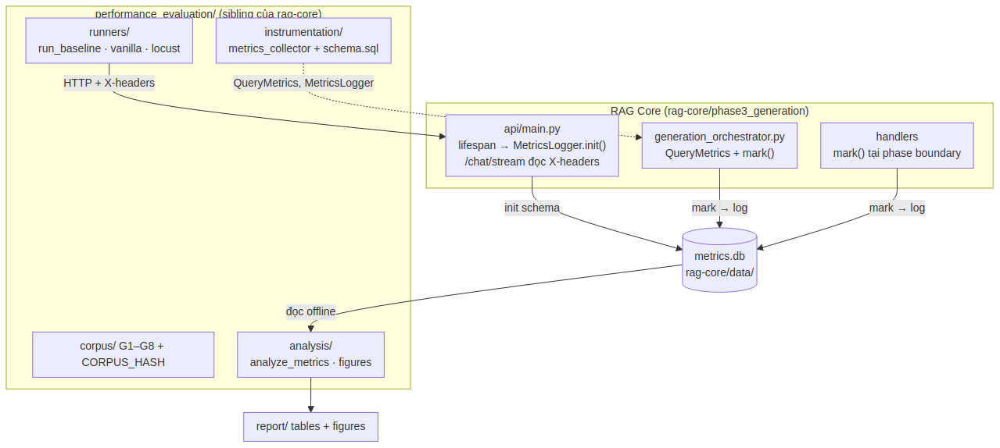
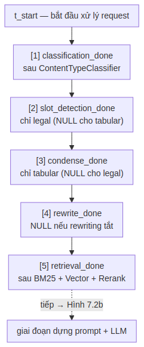
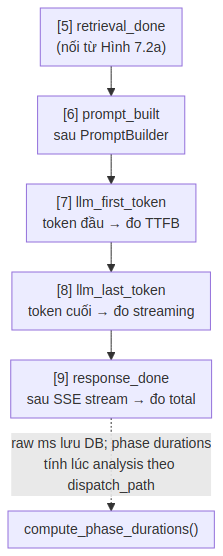
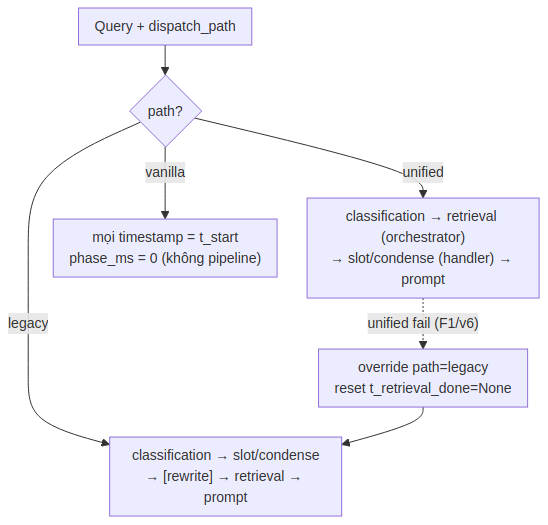
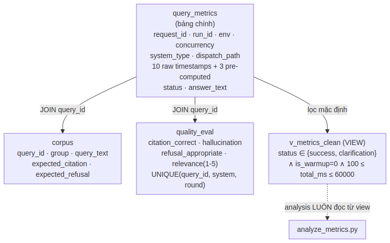
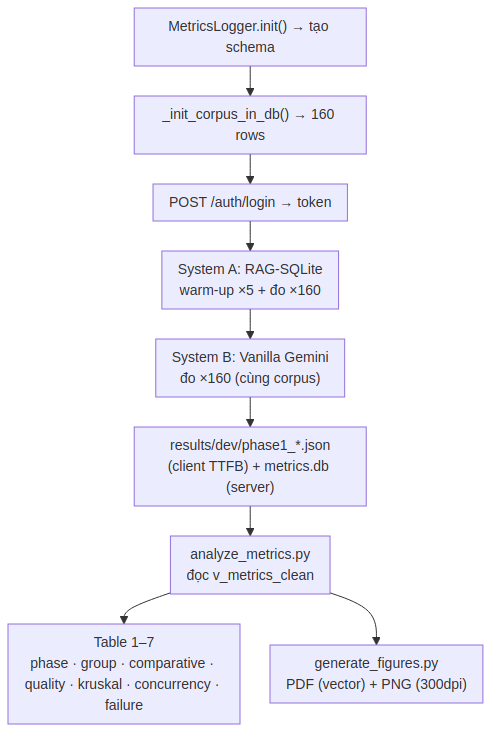
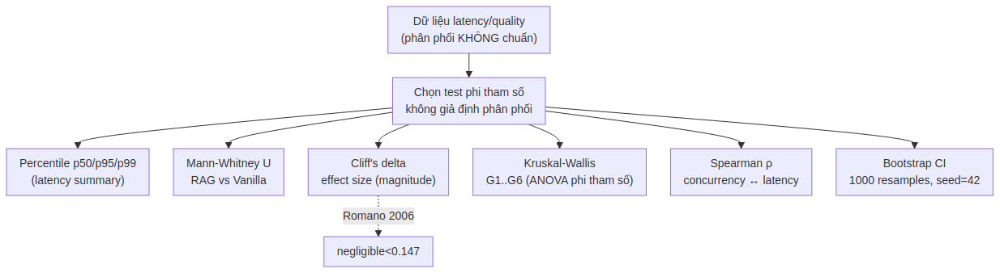
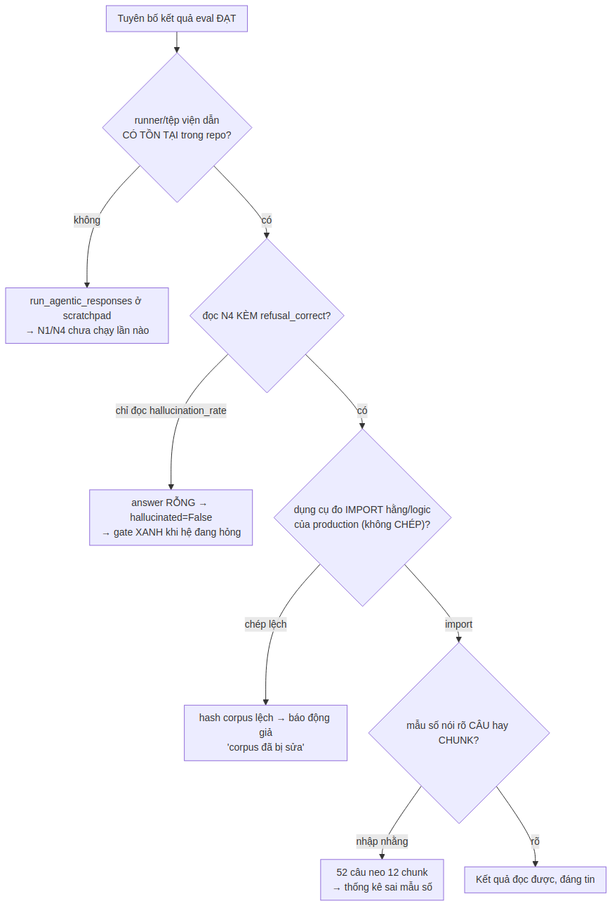

# PHẦN 7 — PERFORMANCE EVALUATION

## 1. Giới thiệu Phần 7

Phần này tài liệu hóa phân hệ **`performance_evaluation/`** — hệ thống đo lường hiệu năng và chất lượng của RAG-Chatbot, phục vụ nghiên cứu khoa học (NCKH) và chuyển giao công nghệ. Đây là một phân hệ **ngang hàng** với `rag-core`, `bff-service`, `agribank-chat` (cùng nằm dưới thư mục gốc `RAG-SQLite/`), có DESIGN.md riêng và vòng đời phát triển riêng.

### 1.1 Vì sao cần một phân hệ đo lường riêng (Why)

Một hệ thống RAG pháp lý đưa vào vận hành cần trả lời được các câu hỏi định lượng mà cảm tính không đáp ứng được: pipeline chậm ở khâu nào, độ trễ có đạt yêu cầu UX không, tải tăng thì độ trễ tăng ra sao, và quan trọng nhất — **RAG có thật sự cải thiện độ chính xác trích dẫn và giảm bịa đặt so với LLM trần hay không**. Phân hệ này được xây để trả lời **5 câu hỏi nghiên cứu (RQ)**:

| RQ | Câu hỏi | Phương pháp đo |
|----|---------|----------------|
| RQ1 | Mỗi phase (classification, retrieval, condense, LLM) chiếm bao nhiêu % latency? | Phase timestamps trong RAG Core |
| RQ2 | Latency p50/p95/p99 ở 1 user có đáp ứng UX? | Sequential baseline, môi trường dev |
| RQ3 | Latency tăng thế nào khi load 1→20 user đồng thời? | Locust load test, môi trường cloud |
| RQ4 | RAG thêm bao nhiêu overhead so với Vanilla Gemini? | So sánh 2 hệ thống, cùng corpus |
| RQ5 | RAG cải thiện citation accuracy, giảm hallucination, tăng relevance? | Manual review, 4 tiêu chí |

### 1.2 Bốn ràng buộc thiết kế cốt lõi

Toàn bộ thiết kế phân hệ bị chi phối bởi bốn ràng buộc — đây là điểm phân biệt một hệ đo lường *đáng tin* với một hệ chỉ *tạo ra số*:

1. **Non-intrusive (không xâm lấn).** Instrumentation chỉ thêm bước ghi timestamp, **không đổi logic nghiệp vụ** của RAG Core. Lỗi instrumentation **không được làm crash** pipeline (best-effort).
2. **Reproducible (tái lập được).** Cùng corpus, cùng seed → cùng kết quả khi chạy lại. Corpus được đóng băng bằng MD5 hash.
3. **Offline-compatible.** Toàn bộ phân tích chạy offline từ `metrics.db`, không cần kết nối service.
4. **Unified format.** Vanilla Gemini và RAG-SQLite phát cùng một định dạng event → dùng chung một pipeline phân tích.

### 1.3 Nguyên tắc bao trùm: dụng cụ đo phải đáng tin trước khi số đáng tin

Phân hệ này đúc kết một triết lý xuyên suốt toàn dự án, phát biểu ngắn gọn:

> **Một con số chỉ có giá trị khi phép đo sinh ra nó đã được chứng minh là CHẠY THẬT và ĐO ĐÚNG THỨ CẦN ĐO.**

Nhiều lỗi nguy hiểm nhất không phải "số sai" mà là "số đẹp nhưng vô nghĩa": gate xanh vì test không chạy, hash lệch vì công cụ đo chép sai, tỷ lệ hallucination = 0 vì câu trả lời rỗng bị đếm nhầm là "không bịa". Mục §9 dành riêng cho lớp kỷ luật này.

### 1.4 Mục lục Phần 7

| § | Tiêu đề | Sơ đồ |
|:-:|---|:-:|
| 2 | Kiến trúc thành phần + vị trí trong hệ thống | Hình 7.1 |
| 3 | Mô hình đo lường — 10 timestamp + 3 dispatch path | Hình 7.2a, 7.2b, 7.3 |
| 4 | Database schema — query_metrics, corpus, quality_eval | Hình 7.4 |
| 5 | Instrumentation Layer — QueryMetrics + MetricsLogger | — |
| 6 | Test Corpus — G1–G8 + reproducibility | — |
| 7 | Runners + Analysis Layer + kiểm định thống kê | Hình 7.5, 7.6 |
| 8 | Điểm tích hợp với RAG Core | — |
| 9 | Kỷ luật đo lường — chống "xanh giả" | Hình 7.7 |
| 10 | Bộ eval Agentic (agentic_eval) | — |
| 11 | Architecture Decision Records (ADR) | — |

### 1.5 Quy ước ký hiệu

- Hình vẽ đánh số `Hình 7.N`; sơ đồ phức tạp chia `a, b`.
- Code/SQL snippet lấy nguyên văn từ source thực tế tại `performance_evaluation/`.
- Tham chiếu chéo: "Phần 2 §4" = mục 4 của Phần 2; "→ §9" = mục 9 trong chính Phần 7 này. Phân hệ này đo hệ thống được mô tả ở Phần 2 (RAG Core) và Phần 6 (Agentic RAG).

---

## 2. Kiến trúc thành phần

### 2.1 Vị trí trong hệ thống (What)

`performance_evaluation/` là **sibling** của `rag-core/` — cả hai nằm dưới thư mục gốc `RAG-SQLite/`. Nó quan sát RAG Core từ bên ngoài (qua HTTP + một lớp instrumentation nhẹ nhúng vào orchestrator), rồi ghi mọi phép đo vào một cơ sở dữ liệu SQLite dùng chung.



*Hình 7.1 — RAG Core (trái) nhúng lớp instrumentation nhẹ: `api/main.py` khởi tạo MetricsLogger lúc startup và đọc X-headers ở `/chat/stream`; orchestrator + handler gọi `mark()` tại mỗi ranh giới phase. Phân hệ performance_evaluation (phải) cung cấp corpus, runner (gửi request), và analysis (đọc offline từ metrics.db → bảng + biểu đồ). Mọi phép đo hội tụ ở `metrics.db`.*

> **Quy ước path bắt buộc:** Mọi script trong phân hệ cần import `core.*`/`shared.*` của RAG Core phải tính `_RAG_CORE = Path(__file__).resolve().parent.parent / "rag-core"`. **Không** dùng `parent.parent.parent` — sẽ trỏ nhầm lên `RAG-SQLite/` thay vì `rag-core/`. Đây là một bug từng làm scorer âm thầm vô dụng (§9).

### 2.2 Cấu trúc thư mục

```
performance_evaluation/          (sibling của rag-core/)
├── corpus/                      # G1–G8 + CORPUS_HASH.txt + generate_corpus.py
├── instrumentation/             # metrics_collector.py + metrics_schema.sql
├── runners/                     # run_baseline.py · vanilla_gemini.py · locustfile.py
├── analysis/                    # analyze_metrics.py · generate_figures.py · export_quality_eval.py
│                                #   + auto_quality_eval.py · auto_eval_grounded.py · check_regression.py
├── agentic_eval/                # bộ eval riêng cho nhánh Agentic (§10)
├── report/                      # tables/ + figures/ (đầu ra)
├── results/                     # kết quả JSON theo run
├── scripts/ · Dockerfile        # chạy eval trong container
└── DESIGN.md · README.md · BC_NCKH.md   # báo cáo nghiên cứu khoa học
```

### 2.3 Luồng dữ liệu ngắn gọn (How)

1. RAG Core khởi động → `MetricsLogger.init()` tạo schema trong `metrics.db`.
2. Runner gửi HTTP request kèm X-headers (`run_id`, `query_id`…).
3. RAG Core tạo `QueryMetrics`, gọi `.mark()` tại mỗi ranh giới phase.
4. `MetricsLogger.log()` ghi một row vào `metrics.db`.
5. Runner song song ghi TTFB phía client vào `results/dev/*.json`.
6. `analyze_metrics.py` đọc `metrics.db` → tính thống kê → `report/tables/`.
7. `generate_figures.py` đọc `metrics.db` → vẽ biểu đồ → `report/figures/`.

---

## 3. Mô hình đo lường — Timestamp Semantics

### 3.1 Mười mốc thời gian (What)

Mỗi query ghi tối đa 10 timestamp bằng `time.perf_counter()` (độ phân giải microsecond). Chuỗi mốc chia hai giai đoạn tự nhiên: tiền-LLM (từ start tới retrieval) và LLM (từ dựng prompt tới stream xong).



*Hình 7.2a — Năm mốc đầu: t_start → classification → slot_detection (chỉ legal) → condense (chỉ tabular) → rewrite (tùy chọn) → retrieval. Hai mốc slot/condense loại trừ nhau theo nhánh nội dung. → tiếp Hình 7.2b.*



*Hình 7.2b — Bốn mốc cuối: retrieval → prompt_built → llm_first_token (đo TTFB) → llm_last_token (đo thời gian streaming) → response_done (đo total). Raw ms được lưu DB; các phase duration được tính lúc phân tích tùy dispatch_path.*

### 3.2 Vì sao tính phase duration lúc phân tích, không lúc ghi (Why + How)

Timestamps được lưu dưới dạng **raw milliseconds** so với `t_start`. Khoảng cách giữa hai mốc (phase duration) được tính tại thời điểm phân tích bởi `compute_phase_durations()`, **không phải lúc ghi DB**.

Lý do: thứ tự các phase phụ thuộc `dispatch_path` (unified/legacy/vanilla). Nếu compute ngay lúc ghi, phải nhét logic phân nhánh vào `to_db_row()` — phức tạp và khó kiểm tra. Ngoại lệ: ba trường **path-independent** (`llm_first_token_ms`, `llm_streaming_ms`, `total_ms`) được tính ngay trong `to_db_row()` vì chúng luôn đúng cho mọi path.

### 3.3 Ba dispatch path



*Hình 7.3 — Thứ tự phase khác nhau theo path: unified (retrieval do orchestrator, trước slot/condense), legacy (slot/condense trước retrieval), vanilla (không pipeline, mọi mốc = t_start). Khi unified thất bại (F1/v6), orchestrator override path=legacy và reset t_retrieval_done=None để legacy handler mark lại đúng vị trí.*

| Path | Khi nào | Thứ tự phase |
|------|---------|--------------|
| `unified` | `unified_dispatch.enabled=true` (mặc định) | classification → retrieval (orchestrator) → slot/condense (handler) → prompt |
| `legacy` | `unified_dispatch.enabled=false` hoặc unified fallback | classification → slot/condense → [rewrite] → retrieval → prompt |
| `vanilla` | Vanilla Gemini (không pipeline) | mọi timestamp = t_start, phase_ms = 0 |

---

## 4. Database Schema

File: `instrumentation/metrics_schema.sql`. Ba bảng + một view.



*Hình 7.4 — query_metrics là bảng chính (một row/query), JOIN với corpus (lấy expected_citation) và quality_eval (đánh giá thủ công) qua query_id. View v_metrics_clean là bộ lọc mặc định mà mọi analysis đọc từ đó — loại error, warmup, và outlier.*

### 4.1 Bảng `query_metrics` — bảng chính (What)

Mỗi query một row. Các nhóm cột: định danh (`request_id` UUID4, `run_id`, `environment`, `concurrency`, `system_type`, `dispatch_path`), thông tin query (`query_id` là JOIN key với corpus, `query_group`), **10 raw timestamp** (`t_*_ms`), **3 trường pre-computed path-independent** (`llm_first_token_ms`, `llm_streaming_ms`, `total_ms`), và outcome (`status`, `answer_text`, `answer_length_*`, `git_sha`, `cold_start`, `is_warmup`).

```sql
CREATE TABLE IF NOT EXISTS query_metrics (
    request_id  TEXT NOT NULL UNIQUE,   -- UUID4 — khóa tracing
    run_id      TEXT NOT NULL,          -- "phase1_20260522_234704_dd1ae6"
    environment TEXT NOT NULL,          -- 'dev' | 'cloud'
    concurrency INTEGER NOT NULL,       -- 1, 5, 10, 15, 20
    system_type TEXT NOT NULL,          -- 'rag_sqlite' | 'vanilla_gemini'
    dispatch_path TEXT,                 -- 'unified' | 'legacy' | 'vanilla'
    query_id    TEXT,                   -- 'G1_001' — JOIN key với corpus
    -- 10 raw timestamps (ms từ t_start) + 3 pre-computed + outcome ...
    status      TEXT NOT NULL,          -- 'success'|'timeout'|'error'|'rate_limit'|'clarification'
    is_warmup   INTEGER DEFAULT 0       -- 1 = warm-up (lọc khỏi analysis)
);
```

### 4.2 Bảng `quality_eval` — đánh giá thủ công 4 tiêu chí

Bốn tiêu chí chất lượng: `citation_correct` (0/1), `hallucination` (0/1), `refusal_appropriate` (0/1), `relevance_score` (1–5). `eval_round` phân biệt lần đầu (1) với re-eval (2, tính Kappa liên-đánh-giá-viên). Ràng buộc `UNIQUE(query_id, system_type, eval_round)` đảm bảo import idempotent — chạy lại không tạo bản trùng.

### 4.3 Bảng `corpus` và view `v_metrics_clean`

Bảng `corpus` (160 query) được `run_baseline.py` insert trước khi chạy, để `export_quality_eval.py` JOIN lấy `expected_citation`/`expected_refusal` (thông tin không có trong `query_metrics`).

**View `v_metrics_clean` là bộ lọc mặc định** — mọi analysis SELECT từ view này, không từ bảng thô:

```sql
CREATE VIEW IF NOT EXISTS v_metrics_clean AS
SELECT * FROM query_metrics
WHERE status IN ('success', 'clarification')   -- loại error
  AND is_warmup = 0                            -- loại 5 warm-up đầu mỗi hệ
  AND total_ms BETWEEN 100 AND 60000;          -- loại outlier (<100ms bug/cache; >60s timeout)
```

> **Vì sao giữ `clarification` trong clean view:** khi hệ thống disambiguate (hỏi lại do nhiều văn bản trùng điều khoản), đó là hành vi bình thường, không phải lỗi — phải tính vào phân tích latency.

---

## 5. Instrumentation Layer

File: `instrumentation/metrics_collector.py`.

### 5.1 `QueryMetrics` — dataclass ghi mốc (What)

`@dataclass` với mọi field có mặc định (dễ khởi tạo từng phần, UUID auto qua `default_factory`). Hai phương thức chính: `mark(phase)` ghi `time.perf_counter()` hiện tại vào `t_<phase>`; `to_db_row()` convert sang dict để INSERT (chỉ compute 3 trường path-independent).

### 5.2 `MetricsLogger` — Singleton, best-effort (How)

Singleton (`init()` một lần trong lifespan, `get()` lấy instance). Ba đặc điểm quan trọng:

- **Best-effort:** `log()` bắt mọi Exception, chỉ ghi warning, **không re-raise**. Lý do: `metrics.db` bị lock hoặc đầy đĩa thì pipeline RAG vẫn phải phục vụ user — đo lường là mối quan tâm thứ cấp. Đây chính là ràng buộc *non-intrusive* (§1.2) hiện thực bằng code.
- **WAL mode:** `PRAGMA journal_mode=WAL` cho phép nhiều reader song song trong khi writer đang insert — quan trọng khi Locust test 20 user đồng thời.
- **Connection-per-write:** mỗi `log()` mở/đóng một connection riêng. SQLite không hưởng lợi từ connection pool như PostgreSQL; WAL xử lý concurrency ở tầng file; tránh shared state giữa các async task.

### 5.3 `compute_phase_durations()` — xử lý NULL theo path

Hàm này tính `phase_ms` từ raw timestamp + `dispatch_path`. Điểm tinh tế: trong unified path, `slot_detection` và `condense` **loại trừ nhau** (legal có slot, tabular có condense), nên `prompt_build_ms` dùng `t["slot"] or t["condense"] or t["retrieval"]` để lấy mốc gần nhất trước prompt, bất kể nhánh nào. Với vanilla, mọi `phase_ms = 0`.

---

## 6. Test Corpus

File: `corpus/generate_corpus.py`.

### 6.1 Sáu nhóm gốc G1–G6 (What)

| Nhóm | Nguồn | Mục đích |
|------|-------|----------|
| G1 | `chunks` có `article_number` + `clause_number` | Path B.5 MongoDB direct fetch |
| G2 | Điều xuất hiện ở ≥2 văn bản | Kích hoạt disambiguation |
| G3 | `chunks` sample + `[NEEDS PARAPHRASE]` | Cần biên tập tay sau |
| G4 | `TABULAR_DATA` | Câu hỏi biểu phí |
| G5 | Manual, dạng dialog nhiều lượt | Skip trong locust |
| G6 | Hardcoded (lịch sử, địa lý, nấu ăn…) | `expected_refusal=True` — câu ngoài phạm vi |

> 🔴 **Không nhóm nào tròn 30.** Số câu thật (đo 2026-09-03): G1=30, G2=**23**, G3=30, G4=**27**, G5=30, G6=**20** → tổng G1–G6 = **160**. G2 chỉ 23 vì số Điều xuất hiện ở ≥2 văn bản là hữu hạn (cạn nguồn, không phải sampling lỗi). **Đừng giả định `160 = 6 × 26,7` đều nhau** khi tính trung bình theo nhóm.

### 6.2 Bốn bộ mới cho luồng general + agent

| Tệp | Số câu | Vai trò |
|-----|:-:|---------|
| `G7_general.json` | 30 | **Dương** — recall nhánh general (tài liệu nội bộ) |
| `G7_negative.json` | 50 | **Âm** — câu KHÔNG được rơi vào general; có nhóm `weak` |
| `G8_sotay_agent.json` | 30 | Agent-path trên sổ tay |
| `G8_hon_hop.json` | 20 | Câu hỗn hợp legal + nội bộ |

> 🔴 **Một bộ âm chỉ đo được LỚP CA NÓ CHỨA — và sẽ xanh rất thuyết phục ở những lớp nó thiếu.** Đó là lý do bộ âm được nâng 30 → 40 → 50 câu kèm nhóm `weak` (¬doc_ref ∧ ¬article_num, mà bộ âm 30 câu cũ mù hoàn toàn), chứ không phải để "có nhiều số liệu hơn".

> ⚠️ **Mẫu số hay nhầm nhất: CÂU HỎI ↔ CHUNK.** Đo 2026-08-31: 52 câu corpus general neo vào chỉ 12 chunk phân biệt. Mọi thống kê trên G7/G8 phải nói rõ mẫu số là **câu** hay **chunk**.

> **G7/G8 KHÔNG nằm trong baseline latency:** chúng không thuộc `_G1G6_merged.json`, không được `run_baseline.py` nạp, và **không làm đổi `CORPUS_HASH.txt`** (phạm vi băm là `groups.keys()` = G1–G6).

### 6.3 Reproducibility — seed cố định + hash (How)

```python
RANDOM_SEED = 42
all_chunks = conn.execute("SELECT ... ORDER BY chunk_id").fetchall()  # deterministic
rng = random.Random(RANDOM_SEED)                                       # không dùng global state
sampled = rng.sample(list(all_chunks), n)
```

`CORPUS_HASH.txt` lưu MD5 để phát hiện corpus bị đổi ngoài ý muốn. Cách tính **thật** (`generate_corpus.py:421-426`): nối text của **chỉ G1–G6** theo `sorted(groups.keys())`, đọc **text mode**, encode một lần ở cuối.

> 🔴 **Bug công cụ đo — báo động giả (bài học §9):** một đoạn mã kiểm hash bản cũ tính sai ở hai điểm — dùng `glob("G*.json")` (hút cả G7/G8) và `read_bytes()` (giữ `\r\n` thay vì để text-mode chuẩn hóa `\n`). Kết quả: hash lệch → người chạy kết luận nhầm "corpus đã bị sửa" trong khi corpus nguyên vẹn. Đây đúng lớp lỗi *"dụng cụ đo phải IMPORT hằng/logic production, không CHÉP"* — bản chép lệch âm thầm và làm mất niềm tin vào dữ liệu đang đúng.

---

## 7. Runners + Analysis Layer

### 7.1 Runners (What)

- **`run_baseline.py`** — Phase 1 tuần tự: init DB + schema → load corpus → insert corpus vào DB → login → chạy warm-up ×5 rồi đo ×160 cho **System A (RAG-SQLite)**, rồi ×160 cho **System B (Vanilla Gemini)** cùng corpus. Đo TTFB phía client qua parse SSE token event.
- **`vanilla_gemini.py`** — `VanillaGeminiClient` phát cùng event protocol để dùng chung pipeline phân tích (`dispatch_path="vanilla"`).
- **`locustfile.py`** — Phase 3 load test cloud, 1→20 user đồng thời.
- **`run_g7_negative_baseline.py`** — runner riêng cho bộ âm 50 câu: bộ âm cần **nền** để đọc được (cổng "không tụt" mà không có sàn nhiễu là cổng không đọc được).



*Hình 7.5 — Baseline chạy hai hệ (RAG-SQLite rồi Vanilla Gemini) trên cùng corpus, ghi song song server-side (metrics.db) và client-side (results JSON). analyze_metrics đọc từ v_metrics_clean sinh 7 bảng; generate_figures xuất PDF (vector, cho publication) + PNG (300dpi, cho báo cáo Word).*

### 7.2 Analysis Layer — kiểm định phi tham số (How)

`analyze_metrics.py` load từ `v_metrics_clean` rồi enrich thêm cột `phase_ms` bằng `compute_phase_durations()`. Vì phân phối latency **không chuẩn**, phân hệ dùng nhất quán các kiểm định **phi tham số**:



*Hình 7.6 — Do latency/quality không phân phối chuẩn, mọi kiểm định đều phi tham số: percentile cho tóm tắt latency, Mann-Whitney U so RAG vs Vanilla, Cliff's delta cho effect size, Kruskal-Wallis so nhiều nhóm, Spearman ρ cho tương quan concurrency-latency, Bootstrap CI cho khoảng tin cậy.*

| Kiểm định | Dùng cho | Lý do |
|-----------|----------|-------|
| Percentile p50/p95/p99 | Tóm tắt latency | Phân phối không chuẩn → mean/std không đủ |
| Bootstrap CI (1000 resample, seed=42) | Khoảng tin cậy | Phi tham số, không giả định phân phối |
| Mann-Whitney U | Latency/Relevance RAG vs Vanilla | Phi tham số |
| Cliff's delta | Effect size | Bổ sung p-value — cho biết magnitude |
| Kruskal-Wallis | Latency G1..G6 | ANOVA phi tham số đa nhóm |
| Spearman ρ | Tương quan concurrency-latency | Robust với outlier |

Ngưỡng Cliff's delta theo Romano et al. (2006): `<0.147` negligible, `<0.33` small, `<0.474` medium, còn lại large.

`generate_figures.py` xuất **PDF (vector, cho publication) + PNG (300dpi, cho báo cáo Word)**; font DejaVu Sans (không cần cài thêm). Bảy bảng đầu ra: phase breakdown, group latency, comparative (Mann-Whitney + Cliff), quality comparison, groups Kruskal, concurrency (+ Spearman), failure rates.

### 7.3 Ba script analysis mới

| Script | Vai trò |
|--------|---------|
| `auto_quality_eval.py` | Chấm chất lượng **tự động** — bổ sung cho `export_quality_eval.py` (thủ công) |
| `auto_eval_grounded.py` | Đo **grounding** — câu trả lời có neo vào nguồn truy hồi không |
| `check_regression.py` | Cổng **hồi quy**: so một lần đo với nền, báo tụt |

> ⚠️ **Chấm tự động KHÔNG thay được review tay cho mọi tiêu chí.** Trong 4 tiêu chí `quality_eval`, máy chấm được hai cái đầu (`citation_correct`, `hallucination` — đối chiếu `expected_citation`); hai cái sau (`refusal_appropriate`, `relevance_score`) vẫn cần người. Đừng đọc "đã có auto eval" thành "không cần review tay nữa".

---

## 8. Điểm tích hợp với RAG Core

Bốn điểm cắm, tất cả **non-breaking** (bọc `try/except`, thiếu phân hệ vẫn chạy):

### 8.1 Startup (`api/main.py`)

Trong `lifespan`, thêm `performance_evaluation/` vào `sys.path` rồi `MetricsLogger.init()` — toàn bộ trong `try/except`. Nếu thư mục không tồn tại (production deploy không include), RAG Core **vẫn khởi động bình thường**. Đây là hiện thực của ràng buộc non-intrusive.

### 8.2 HTTP headers (`/chat/stream`)

Endpoint đọc `X-Run-Id`, `X-Query-Id`, `X-Query-Group`, `X-Is-Warmup`, `X-Cold-Start`. FastAPI không tự map header có dấu `-`, nên phải đọc thủ công qua `request.headers.get("x-run-id")`.

### 8.3 Orchestrator (`generation_orchestrator.py`)

Init `QueryMetrics` đầu orchestrator (đọc `run_id`/`environment`/`concurrency` từ env), `mark("classification_done")` + set `dispatch_path` sau classification, `mark("retrieval_done")` sau retrieval. Fallback F1/v6: override `dispatch_path="legacy"` + reset `t_retrieval_done=None`.

### 8.4 Handlers

`legal_handler` mark `slot_detection_done`; `tabular_handler` mark `condense_done`; `base_handler` mark `prompt_built`/`llm_first_token`/`llm_last_token`/`response_done`, và cuối `_stream_llm()` gọi `MetricsLogger.get().log(metrics)` trong khối `finally` (đảm bảo ghi kể cả khi có lỗi).

---

## 9. Kỷ luật đo lường — chống "xanh giả"

Đây là mục quan trọng nhất về mặt phương pháp. Phân hệ đo lường chỉ có giá trị nếu bản thân phép đo đáng tin. Bốn lớp lỗi thực tế, mỗi lớp tạo ra một con số "đẹp nhưng vô nghĩa":



*Hình 7.7 — Trước khi tin một kết quả eval phải qua bốn cửa kiểm, mỗi cửa ứng với một lớp lỗi thật: công cụ viện dẫn có tồn tại trong repo không, chỉ số có được đọc kèm chỉ số bù không, dụng cụ đo import hay chép logic production, và mẫu số câu/chunk có rõ ràng không.*

### 9.1 Công cụ viện dẫn phải TỒN TẠI trong repo

`run_agentic_responses.py` trước giai đoạn G chỉ nằm ở scratchpad ⇒ **hai gate cứng N1/N4 chưa bao giờ chạy được** (bộ eval = runner + scorer; thiếu runner thì scorer không có gì để chấm). Tài liệu bản trước ghi "sinh responses qua runner riêng, cần DB" — mô tả một thứ *chưa tồn tại* như một bước quy trình bình thường. Bài học: **một quy trình viết ra mà công cụ của nó không có trong repo thì gate dựa vào nó không chạy lần nào, và không ai phát hiện vì tài liệu đọc như thể mọi thứ đã sẵn sàng.**

### 9.2 Đọc chỉ số KÈM chỉ số bù

`_is_refusal("")` trả `False`, nên một câu N4 có answer **RỖNG** làm `hallucinated = (not refused) and citations > 0 = False` → đóng góp **0.0** vào `hallucination_rate`: **gate vẫn XANH trong khi hệ thống đang hỏng**. Chỉ `refusal_correct` tụt mới lộ ra. ⇒ **Hai chỉ số đi cặp, đọc riêng một cái là đọc sai.** Đây cũng là lý do runner phải thoát với **exit code 2** khi gặp answer rỗng — chặn ở tầng sinh dữ liệu, trước khi scorer kịp cho một con số đẹp vô nghĩa.

### 9.3 Dụng cụ đo IMPORT, không CHÉP logic production

Đoạn kiểm hash corpus bản cũ chép lại logic thay vì import, và chép lệch (glob thay vì `groups.keys()`, `read_bytes` thay vì text mode) → hash lệch → báo động giả "corpus đã bị sửa". Bản chép lệch **âm thầm** và lệch theo hướng làm mất niềm tin vào dữ liệu đang đúng. Nguyên tắc: scorer/checker **import chính hằng số/logic của production**, không hardcode lần hai (ví dụ `TEMPORAL_BLOCK_MARKER` ở Phần 6 §14.3 cũng theo luật này).

### 9.4 Bốn quy tắc chống "xanh giả" (từ 4 lần trượt gate)

Rút từ chính lịch sử dự án (Phần 6 §16.2 mô tả cùng bộ quy tắc ở góc nhìn Agentic):

1. **`collected N items > 0`** — test phải nằm trong `testpaths`; `collected 0 items` là gate rỗng.
2. **Kết quả rỗng phải phân biệt "lọc đúng" vs "chưa index"** — rỗng do chưa build BM25 không phải bằng chứng filter hoạt động.
3. **Gate tham chiếu corpus phải verify corpus tồn tại** — trỏ nhóm eval không tồn tại thì gate vô nghĩa.
4. **Test parity phải liệt kê call site bằng AST, không regex/trí nhớ** — parity chỉ phủ 2/4 đường là parity giả.

> **Bẫy log:** gate dựa trên log phải kiểm dòng đó thật sự có trong `rag-core/logs/generation.log`. `setup_logging()` **không bao giờ** đặt `propagate=False` — làm vậy cắt cây `rag_legal.*` khỏi handler ROOT ⇒ log nghiệp vụ rời khỏi file ⇒ gate không đo được (đã xảy ra thật).

### 9.5 Kỷ luật đo phi tất định

Mọi gate eval chạy **≥3 vòng** vì `temperature=0.1` không seed (phi tất định). Báo cáo **per-group**, không chỉ aggregate; gate phải đi kèm metric bù để tránh "xanh nhờ gaming"; phân biệt **structural zero** (cấu trúc không thể khác 0) với **observed zero** (đo được 0).

---

## 10. Bộ eval Agentic (`agentic_eval/`)

Thư mục `agentic_eval/` là bộ đánh giá riêng cho nhánh Agentic (Phần 6), song song với corpus G1–G6 của RAG-SQLite. Chi tiết bốn nhóm N1–N4 đã mô tả ở Phần 6 §8; mục này ghi phần thuộc phân hệ đo lường.

### 10.1 Cấu trúc

| File | Vai trò |
|------|---------|
| `agentic_eval_corpus.json` | Corpus 4 nhóm N1–N4 — **41 câu** (đo 2026-09-03), mỗi câu có đáp án vàng về căn cứ |
| `agentic_eval_scorer.py` | Chấm: citation precision/recall, refusal accuracy, tool/route correctness |
| `run_agentic_responses.py` | Runner gọi agent THẬT sinh responses (§9.1) |
| `router_log_analyzer.py` | Phân tích log Router (pha shadow) để bật dần |
| `test_agentic_eval.py` | Test scorer + analyzer |

### 10.2 Chấm theo CĂN CỨ + quy trình chạy

Scorer tái dùng `CitationGuard.extract_citations` + `_normalize_doc` (Phần 6 §5) để trích và khớp văn bản linh hoạt — đo trực tiếp hai chỉ số quan trọng nhất: chống hallucinate (precision + refusal) và năng lực đa bước (recall + tool). Quy trình: (1) `run_agentic_responses.py` sinh responses qua agent thật với server chạy ở `:8001` — **exit code phải = 0**, nếu = 2 (có answer rỗng) thì DỪNG; (2) `agentic_eval_scorer.py` chấm offline; (3) `router_log_analyzer.py` phân tích log để quyết bật `conservative`.

> ⚠️ **Runner map nhãn SSE tiếng Việt → tên tool** (`STEP_TO_TOOL`, đảo bảng `_event_to_step_text`) vì scorer so `tool_calls` với `expected_tools` dạng `search_legal`/`compute`. Bỏ map ⇒ `tool_correct` của N2/N3 luôn = 0 dù agent gọi đúng tool ("đỏ giả" — cùng lớp lỗi §9.2).

### 10.3 Hai gate cứng

**N1 `route_correct` = 1.0** (không kéo câu đơn giản vào agent) và **N4 `hallucination_rate` = 0.0** (không bịa trích dẫn). Phải đọc N4 **kèm** `refusal_correct` (§9.2). Quy mô corpus khi triển khai thật: mở rộng lên ~110 câu (N1≈40, N2≈25, N3≈25, N4≈20) — xây N1–N3 từ log câu hỏi thật, tự thiết kế N4 (câu đối kháng hiếm xuất hiện tự nhiên).

---

## 11. Architecture Decision Records (ADR)

Các quyết định thiết kế quan trọng của phân hệ. Mỗi ADR: Quyết định / Lý do / Đánh đổi / Khi nào nên đổi.

### ADR-7.1 — Raw timestamp thay vì phase duration tính sẵn

- **Quyết định:** Lưu raw timestamp (ms từ t_start); tính phase duration lúc phân tích qua `compute_phase_durations()`. Ngoại lệ: 3 trường path-independent tính ngay.
- **Lý do:** Thứ tự phase phụ thuộc dispatch_path; compute lúc ghi phải nhét logic phân nhánh vào `to_db_row()`, phức tạp và khó test.
- **Đánh đổi:** Analysis phải biết dispatch_path để tính đúng; một bước enrich thêm khi load.
- **Khi nào nên đổi:** Nếu chỉ còn một dispatch_path duy nhất thì có thể tính sẵn. Hiện có ba path nên giữ.

### ADR-7.2 — MetricsLogger Singleton + best-effort

- **Quyết định:** MetricsLogger là singleton; `log()` best-effort (nuốt lỗi, chỉ warning).
- **Lý do:** Instrumentation là mối quan tâm thứ cấp — lỗi ghi metric không được làm hỏng request phục vụ user (ràng buộc non-intrusive).
- **Đánh đổi:** Có thể mất một số row metric khi DB lock/đầy đĩa; chấp nhận được vì đo lường không phải nghiệp vụ chính.
- **Khi nào nên đổi:** Không. Best-effort là điều kiện để phân hệ đo được nhúng an toàn vào production.

### ADR-7.3 — WAL + connection-per-write cho SQLite

- **Quyết định:** WAL mode + mở/đóng connection mỗi lần `log()`, không connection pool.
- **Lý do:** SQLite không hưởng lợi từ pool như PostgreSQL; WAL xử lý concurrency ở tầng file; tránh shared state giữa async task (quan trọng khi Locust 20 user).
- **Đánh đổi:** Chi phí mở/đóng connection mỗi write; không đáng kể so với latency LLM.
- **Khi nào nên đổi:** Nếu đổi sang PostgreSQL/DB server thật thì dùng pool.

### ADR-7.4 — Corpus đóng băng bằng hash trước khi chạy

- **Quyết định:** Corpus G1–G6 sinh với seed cố định (42), đóng băng bằng MD5 (`CORPUS_HASH.txt`); phạm vi băm chỉ G1–G6.
- **Lý do:** Reproducibility — cùng corpus mới so sánh được các run. Hash phát hiện corpus đổi ngoài ý muốn.
- **Đánh đổi:** Thêm G7/G8 phải nằm ngoài phạm vi băm (đúng thiết kế); công cụ kiểm hash phải import đúng logic, không chép (§9.3).
- **Khi nào nên đổi:** Đổi corpus baseline thì regenerate + cập nhật hash có chủ đích, ghi rõ lý do.

### ADR-7.5 — v_metrics_clean là VIEW, không phải bảng

- **Quyết định:** Bộ lọc mặc định (error/warmup/outlier) là một VIEW; analysis luôn đọc từ view.
- **Lý do:** Một nguồn lọc duy nhất, nhất quán mọi analysis; sửa ngưỡng chỉ sửa một chỗ (DROP+CREATE lại view).
- **Đánh đổi:** Sửa ngưỡng ảnh hưởng **hồi tố** mọi analysis từ metrics.db đã có.
- **Khi nào nên đổi:** Điều chỉnh ngưỡng outlier khi phân phối latency thực tế đổi (vd hạ tầng nhanh hơn).

### ADR-7.6 — Unified event format cho RAG và Vanilla

- **Quyết định:** Vanilla Gemini phát cùng event protocol với RAG-SQLite (`dispatch_path="vanilla"`, mọi mốc = t_start).
- **Lý do:** Dùng chung một pipeline phân tích; `analyze_metrics.py` tự include hệ mới qua `GROUP BY system_type`.
- **Đánh đổi:** Client vanilla phải giả lập một số trường không có nghĩa (phase_ms=0).
- **Khi nào nên đổi:** Không. Đây là điều kiện để so sánh công bằng cùng corpus.

### ADR-7.7 — Dụng cụ đo import logic production, không chép

- **Quyết định:** Scorer/checker import trực tiếp hằng số và hàm của production (`extract_citations`, `_normalize_doc`, `TEMPORAL_BLOCK_MARKER`, logic hash), không hardcode/chép lần hai.
- **Lý do:** Bản chép lệch âm thầm (§9.3) tạo báo động giả hoặc bỏ sót thật; import đảm bảo dụng cụ đo và hệ được đo luôn khớp.
- **Đánh đổi:** Dụng cụ đo phụ thuộc vào việc production giữ API ổn định; đổi API production phải cập nhật scorer.
- **Khi nào nên đổi:** Không nới lỏng. Đây là nền của toàn bộ độ tin cậy phép đo.

---

## 12. Tổng kết

`performance_evaluation/` là phân hệ đo lường ngang hàng với ba service chính, trả lời 5 câu hỏi nghiên cứu về latency (theo phase, theo tải), overhead của RAG so với LLM trần, và chất lượng (citation accuracy, hallucination, relevance). Kiến trúc gồm một lớp instrumentation nhẹ non-intrusive nhúng vào RAG Core (10 timestamp, best-effort logging), một mô hình dữ liệu SQLite với view lọc mặc định, một bộ corpus G1–G8 đóng băng bằng hash, và một tầng phân tích dùng nhất quán các kiểm định phi tham số.

Giá trị lớn nhất của phân hệ không chỉ là các con số nó tạo ra, mà là **bộ kỷ luật đảm bảo con số đáng tin**: công cụ viện dẫn phải tồn tại thật, chỉ số phải đọc kèm chỉ số bù, dụng cụ đo phải import chứ không chép logic production, và mẫu số câu/chunk phải minh bạch. Nguyên tắc bao trùm — *một con số chỉ có giá trị khi phép đo sinh ra nó đã được chứng minh là chạy thật và đo đúng thứ cần đo* — là bài học áp dụng cho mọi phân hệ, không riêng đo lường.

> **Hết Phần 7 — Performance Evaluation.** Phân hệ này đo hệ thống mô tả ở Phần 2 (RAG Core) và Phần 6 (Agentic RAG). Tài liệu kỹ thuật sâu hơn: `performance_evaluation/DESIGN.md` và `BC_NCKH.md` (báo cáo nghiên cứu khoa học).
