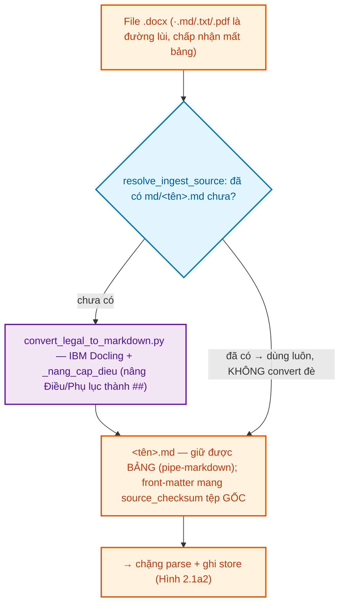

```mermaid
flowchart TB
    L_IN["File .docx (·.md/.txt/.pdf là đường lùi, chấp nhận mất bảng)"]
    L_RES{"resolve_ingest_source: đã có md/&lt;tên&gt;.md chưa?"}
    L_CONV["convert_legal_to_markdown.py — IBM Docling + _nang_cap_dieu (nâng Điều/Phụ lục thành ##)"]
    L_MD["&lt;tên&gt;.md — giữ được BẢNG (pipe-markdown); front-matter mang source_checksum tệp GỐC"]
    L_NEXT["→ chặng parse + ghi store (Hình 2.1a2)"]
    L_IN --> L_RES
    L_RES -->|"chưa có"| L_CONV --> L_MD
    L_RES -->|"đã có → dùng luôn, KHÔNG convert đè"| L_MD
    L_MD --> L_NEXT
    classDef legal fill:#E1F5FE,stroke:#0277BD,stroke-width:2px,color:#01579B
    classDef io fill:#FFF3E0,stroke:#E65100,stroke-width:2px,color:#BF360C
    classDef write fill:#F3E5F5,stroke:#6A1B9A,stroke-width:2px,color:#4A148C
    class L_RES legal
    class L_IN,L_MD,L_NEXT io
    class L_CONV write
```
